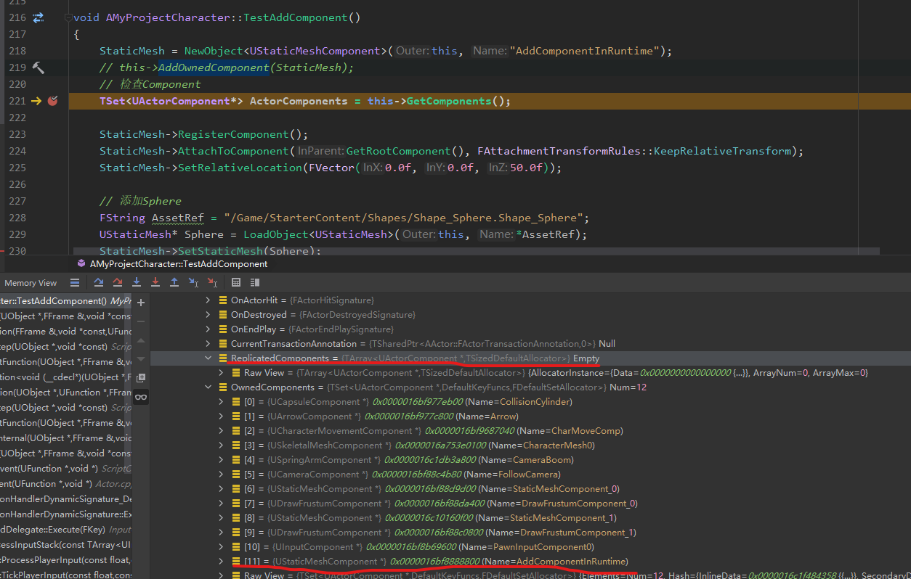

[toc]

# 参考
[Actors官方说明](https://docs.unrealengine.com/4.27/zh-CN/ProgrammingAndScripting/ProgrammingWithCPP/UnrealArchitecture/Actors/)
UE4.26.2 源码，略过网络复制

# Actor文档
## 定义
所有可以放入关卡的对象都是Actor。这个定义很重要！
Actor不直接保存变换（位置、旋转和缩放）数据。如Actor 的根组件存在，则使用它的变换数据。

## 组件
某种意义上，Actor可被视为包含组件的容器。Actor 的其他主要功能是在游戏进程中在网络上进行属性复制和函数调用
组件的主要类型：
- UActorComponent：基础组件，可作为Actor 的一部分被包含。需要时可进行Tick 。ActorComponents与特定的Actor关联，但不存在与场景中的任意特定位置。通常用于概念上的功能，如AI或解译玩家输入。最适用于抽象行为。
- USceneComponent：是拥有变换的ActorComponents。变换指场景中的位置，旋转和缩放定义。SceneComponents能以层级的方式相互附加。Actor的变换取自位于层级根部的SceneComponent。支持基于位置的行为，这类行为不需要集合表示，如弹簧臂、摄像机、物理力和约束等。
- UPrimitiveComponent：是拥有一类图像表达（网格体、粒子系统等）的SceneComponent。拥有集合表示的场景组件，通常用于渲染视觉元素或与物理对象发生碰撞或重叠。包括静态或骨架网格体、粒子系统、胶囊体碰撞体积。

Actor支持拥有一个SceneComponent的层级。每个Actor也拥有一个`RootComponent`属性作为Actor根的组件。Actor自身不含变换，依赖于其组件的变换，具体点是根组件的变换。其他附加的组件拥有其附加到的组件的变换。
Actor及其层级的范例
- 根-SceneComponent：场景中设置Actor基础位置的基础场景组件。
- - StaticMeishComponent：表示金矿石的网格体。
- - - ParticleSystemComponent：金矿石的闪烁例子发射器
- - - AudioComponent：金矿石的金属声发射器
- - - BoxComponent：碰撞盒体，用作拾取黄金重叠事件的触发器。

## Ticking
所有Actor均可通过Tick() 函数默认被tick
ActorComponents能够默认被更新，使用TickComponent() 函数

**Tick组**

Ticking根据tick组发生。Actor或组件的tick组用于确定在帧中何时进行tick。每个tick组将完成对指定的每个actor和组件的tick，然后再开始下一个tick组。actors或组件还可以设置tick依赖性，即其他特定actor或组件的tick函数完成后他们才会进行tick。

**tick组按运行顺序排序**

| Tick组            | 引擎活动                                                     |
| ----------------- | ------------------------------------------------------------ |
| TG_PrePhysics     | 帧的开始                                                     |
| TG_DuringPhysics  | 开始物理模拟并更新引擎的物理数据。物理数据来自上一帧或当前帧 |
| TG_PostPhysics    | 此步骤开始时物理模拟已经完成，引擎使用当前帧的数据           |
| n/a               | 处理隐藏操作、tick世界时间管理器、更新摄像机、更新关卡流送体积域和流送操作 |
| TG_PostUpdateWork | n/a                                                          |
| n/a               | 处理之前在帧中创建的actor的延迟生成。完成帧并渲染            |

TG_PostPhysics 可用于武器或运动追踪。渲渲染此帧时所有物理对象将位于它们的最终位置，一帧延迟也会明显

TG_PosUpdateWork

- 在TG_PostPhysics之后运行，它的基函数是将最靠后的信息送入粒子系统
- TG_PosUpdateWork在摄像机更新后发生。如特效必须知晓摄像机朝向的准确位置，可将控制这些特效的actor放置于此
- 也可用于在帧中绝对最靠后运行的游戏逻辑

**Tick依赖性**

`AddTickPrerequisiteActor`和`AddTickPrerequisiteComponent`函数将设置存在函数调用的actor或组件等待tick

## 生命周期
实例化Actor有三种主要路径。Actor 的销毁路径都是相同的
**从磁盘加载**

已位于关卡中的Actor使用此路径，如LoadMap发生时，AddToWorld（从流关卡或子关卡）被调用时。

- 包/关卡中的Actor从磁盘中进行加载
- PostLoad - 在序列化Actor从磁盘加载完后被调用。此处可执行自定义版本化或修复操作。PostLoad 与 PoatActorCreated互斥
- InitializeActorsForPlay
- 为未初始化的Actor执行RouteActorInitialize（包含无缝行程携带）
- - PreInitializeComponents - Actor组件上调用InitializeComponent之前调用
  - InitializeComponent - Actor上定义的每个组件的创建辅助函数
  - PostInitializeComponent - Actor的组件初始化后调用
- BeginPlay - 关卡开始后调用

**play in editor**

该路径的Actor是从编辑器复制来的！

- 编辑器中的Actor被复制到新场景中
- PostDuplicate 被调用
- InitializeActorsForPlay
- 为未初始化的Actor执行RouteActorInitialize（包含无缝行程携带）
- - PreInitializeComponents - Actor组件上调用InitializeComponent之前调用
  - InitializeComponent - Actor上定义的每个组件的创建辅助函数
  - PostInitializeComponent - Actor的组件初始化后调用
- BeginPlay - 关卡开始后调用

**生成**

这是生成（实例）Actor时的路径

- SpawnActor被调用
- PostSpawnInitialize
- PostActorCreated - 创建后被生成的Actor调用，发生构建函数类行为。PostLoad 与 PoatActorCreated互斥
- ExecuteConstruction
- - OnConstruction - Actor 的构建。蓝图Actor 的组件在此创建，蓝图变量在此初始化
- PostActorConstruction
- - PreInitializeComponents - Actor组件上调用InitializeComponent之前调用
  - InitializeComponent - Actor上定义的每个组件的创建辅助函数
  - PostInitializeComponent - Actor的组件初始化后调用
- OnActorSpawned 在UWorld上播放
- BeginPlay被调用

**延迟生成**

将任意属性设为“Expose on Spawn”即可延迟Actor 的生成

- SpawnActorDeferred - 生成程序化Actor，在蓝图构建脚本之前进行额外设置
- SpawnActor中所有操作发生；PostActorCreated之后发生以下操作：
- - 通过一个有效但不完整的Actor实例设置/调用多个“初始化函数”
  - FinishSpawningActor - 调用后对Actor进行最终化，在Spawn Actor行中选取ExecuteConstruction

**销毁Actor**

Actor通常不会被垃圾回收，因为场景对象保存一个Actor引用的列表。调用Destroy() 可显式销毁Actor，将其从关卡中移除并标记为“待销毁”，这说明其在下次垃圾回收中被清理之前都将存在。

**垃圾回收**

对象被标记待销毁一段时间后，垃圾回收会将其从内存中实际移除，释放资源。

销毁时调用以下函数

- BeginDestroy - 对象可利用此机会释放内存并处理其他多线程资源（即图像线程代理对象）。与销毁相关的大多数游戏性功能应该在`EndPlay`中更早地被处理。
- IsReadyForFinishDestroy - 调用此函数以确定对象是否可被永久解除分配。
- FinishDestroy - 销毁对象。

# Actor
Actor定义之前有一系列委托，根据命名大体可这样划分
- 受到Actor伤害
- 与Actor 重叠、碰撞
- 光标重叠、点击
- Touch事件
- 当前Actor的Destroyed，EndPlay

> Actor是能在关卡中放置或生成的基础对象。它可以包含ActorComponents的集合，用来控制Actor的移动、渲染等。Actor的另一个主要功能是能在运行时通过网络进行属性复制和函数调用。

Transform相关的都是跑到RootComponent去执行，包括前向向量，速度等。


## 部分成员变量
| 变量 | 含义 |
|--|--|
| struct FActorTickFunction PrimaryActorTick | 主要的Tick数据结构，被TickActor()调用 |
| TEnumAsByte\<EAutoReceiveInput::Type> AutoReceiveInput | 选择接受玩家的输入（Player0, Player1...） |
| class UInputComponent* InputComponent | 处理输入的组件 |
| TArray<AActor*> Children | 当前Actor所拥有的的所有子Actor，这些子Actor不一定是通过UChildActorComponent生成 |
| USceneComponent* RootComponent | 定义当前Actor在世界中的变换（位置、旋转、缩放）的组件。所有其它组件必须以某种方式附加到该组件 |
| TWeakObjectPtr<UChildActorComponent> ParentComponent | 拥有当前Actor的UChildActorComponent |
| TArray<FName> Tags | 标签 |
| APawn* Instigator | 当前Actor产生伤害或其他 gameplay events 的Pawn代表。假如一个玩家拿枪伤害另一个玩家，则Instigator 表示子弹 |


## 部分函数
### IsAsset()
Actor的子类不是资产，相关资产部分参考[资产管理](https://docs.unrealengine.com/4.27/zh-CN/ProductionPipelines/AssetManagement/)
```cpp
bool AActor::IsAsset() const
{
	return IsPackageExternal() && !IsChildActor() && !HasAnyFlags(RF_Transient | RF_ClassDefaultObject);
}
```
### OnSubobjectCreatedFromReplication
当通过复制动态创建子对象时，该函数会被调用。这里组件创建出来后会先被注册
```cpp
void AActor::OnSubobjectCreatedFromReplication(UObject *NewSubobject)
{
	check(NewSubobject);
	if ( UActorComponent * Component = Cast<UActorComponent>(NewSubobject) )
	{
		Component->RegisterComponent();
		Component->SetIsReplicated(true);
	}
}
```

### EnableInput
应用玩家输入的处理也是转发给PlayerController 去处理的。这里截取片段，其中会用到输入组件。
```cpp
virtual void EnableInput(class APlayerController* PlayerController) {
	// ...
	if (!InputComponent)
	{
		InputComponent = NewObject<UInputComponent>(this, UInputSettings::GetDefaultInputComponentClass());
		InputComponent->RegisterComponent();
		InputComponent->bBlockInput = bBlockInput;
		InputComponent->Priority = InputPriority;

		UInputDelegateBinding::BindInputDelegates(GetClass(), InputComponent);
	}
	//...
}
```

### ActorToWorld
场景上的变换是跟RootComponent（即SceneComponent）相关的，
```cpp
FORCEINLINE const FTransform& ActorToWorld() const
{
	return (RootComponent ? RootComponent->GetComponentTransform() : FTransform::Identity);
}
```

### AddComponent
该函数是在`ActorConstruction.cpp`中实现的，这里主要说明新组件的安装需要进行的步骤
```cpp
UActorComponent* AActor::AddComponent(...)
{
	FinishAddComponent();
}
void AActor::FinishAddComponent(...)
{
	//...
	NewSceneComp->SetupAttachment(RootComponent);
	//...
	NewSceneComp->SetRelativeTransform(RelativeTransform);
	//...
	NewActorComp->RegisterComponent();
	// 后续更新世界中被该组件体积影响的其他数据
}
```

### BeginPlay
组件中的BeginPlay是在Actor的蓝图BeginPlay之前，该函数是受保护的，`DispatchBeginPlay()`则以正确的顺序执行Begin。
```cpp
void AActor::BeginPlay()
{
	//...
	RegisterAllActorTickFunctions(true, false); // Components are done below.
	//...
	for (UActorComponent* Component : Components)
	{
		if (Component->IsRegistered() && !Component->HasBegunPlay())
		{
			Component->RegisterAllComponentTickFunctions(true);
			Component->BeginPlay();
		}
	}
	//...
	ReceiveBeginPlay(); // 蓝图中的 BeginPlay
}
```

### GetParentActor
该函数表示的应该是Actor的嵌套关系，通过组件实现Actor的间接嵌套。
```cpp
AActor* AActor::GetParentActor() const
{
	AActor* ParentActor = nullptr;
	if (UChildActorComponent* ParentComponentPtr = GetParentComponent())
	{
		ParentActor = ParentComponentPtr->GetOwner();
	}

	return ParentActor;
}
```

### GetWorld
如果actor不在level中则为null
```cpp
UWorld* AActor::GetWorld() const
{
	// CDO objects do not belong to a world
	// If the actors outer is destroyed or unreachable we are shutting down and the world should be nullptr
	if (!HasAnyFlags(RF_ClassDefaultObject) && ensureMsgf(GetOuter(), TEXT("Actor: %s has a null OuterPrivate in AActor::GetWorld()"), *GetFullName())
		&& !GetOuter()->HasAnyFlags(RF_BeginDestroyed) && !GetOuter()->IsUnreachable())
	{
		if (ULevel* Level = GetLevel())
		{
			return Level->OwningWorld;
		}
	}
	return nullptr;
}
```

# 疑惑
- AttachToActor()，GetParentActor() 是能实现Actor 的嵌套吗
- Script Construction 是怎么用的，蓝图中也有
- 如何动态给Actor添加组件

# 解答
## AttachToActor()，GetParentActor() 是能实现Actor 的嵌套吗
Actor无法直接嵌套。
看`AttachToActor`实现，本质上是RootComponent 的嵌套。在蓝图中可以调用函数`AttachActorToActor`，传参都是ParentActor，SocketName和一些Rule。
```cpp
void AActor::AttachToActor(AActor* ParentActor, const FAttachmentTransformRules& AttachmentRules, FName SocketName)
{
	if (RootComponent && ParentActor)
	{
		USceneComponent* ParentDefaultAttachComponent = ParentActor->GetDefaultAttachComponent();
		if (ParentDefaultAttachComponent)
		{
			RootComponent->AttachToComponent(ParentDefaultAttachComponent, AttachmentRules, SocketName);
		}
	}
}
```

对于GetParentActor，可以看到是检查组件`UChildActorComponent`(源码在函数介绍中)，此处转蓝图容易理解，在蓝图使用组件`ChildActorComponent`，可以通过该组件实现Actor 的间接嵌套，然后在Child Actor上调用该函数获取Parent Actor。

## Script Construction 是怎么用的，蓝图中也有
[构造脚本](https://docs.unrealengine.com/4.27/zh-CN/ProgrammingAndScripting/Blueprints/UserGuide/UserConstructionScript/)
[1.4-构造脚本](https://docs.unrealengine.com/4.26/zh-CN/Resources/ContentExamples/Blueprints/1_4/)
构造脚本适合处理需要在游戏开始前计算的内容。游戏开始后构造脚本将停止执行。此时构造脚本执行的所有内容都将视为完成。
构造脚本用来在创建组件之后，执行一些设置或者计算。
在商城中可获取“蓝图”项目官方模板，查看里面样例。

## 如何动态给Actor添加组件
给第三人称模板的Character加个Sphere吧。
MyProjectCharacter.h
```cpp
	UFUNCTION(BlueprintCallable)
	void TestAddComponent();
	// 设成UPROPERTY，反射在UE编辑器中可见，方便调试
	// 换成函数内的局部变量，不影响结果，但是在UE编辑器中不可见
	UPROPERTY(VisibleAnywhere)
	UStaticMeshComponent* StaticMesh;
```
MyProjectCharacter.cpp
```cpp
void AMyProjectCharacter::TestAddComponent()
{
	StaticMesh = NewObject<UStaticMeshComponent>(this, "AddComponentInRuntime");
	this->AddOwnedComponent(StaticMesh);
	// 检查Component
	
	StaticMesh->RegisterComponent();
	StaticMesh->AttachToComponent(GetRootComponent(), FAttachmentTransformRules::KeepRelativeTransform);
	StaticMesh->SetRelativeLocation(FVector(0.0f, 0.0f, 50.0f));

	// 添加Sphere
	FString AssetRef = "/Game/StarterContent/Shapes/Shape_Sphere.Shape_Sphere";
	UStaticMesh* Sphere = LoadObject<UStaticMesh>(this, *AssetRef);
	StaticMesh->SetStaticMesh(Sphere);
}
```
之后在蓝图中设置按键调用就好。
**tips**
有的网上教程对`AddOwnedComponent`有争议，这里打断点查看该函数的影响。
当不执行该函数时，查看this 堆栈，可以看到`OwnedComponents`是存在该组件的，但是`ReplicatedComponents`中不存在该组件，而该函数其中有一项就是往`ReplicatedComponents`里面添加组件，所以最好还是习惯性添加该函数
