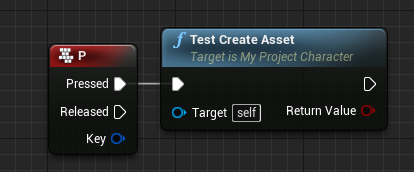
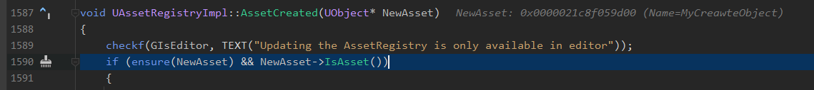
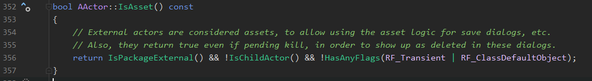
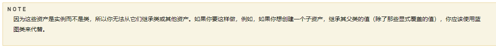
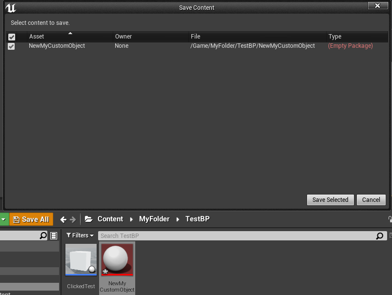
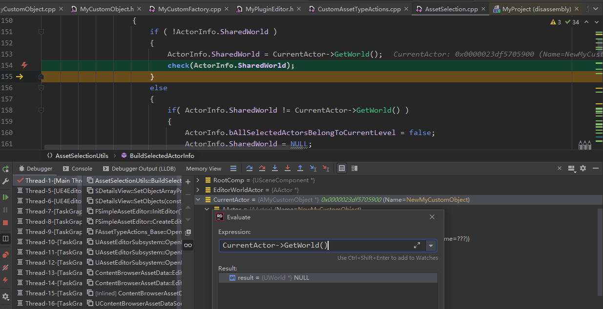
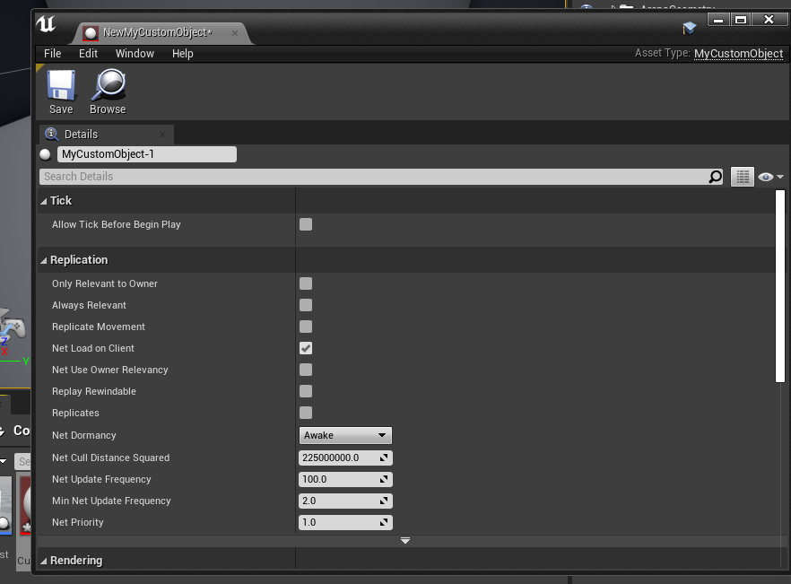

[toc]

## 注意
该文档的目标是创建一个uasset文件，用来保存类的实例，而不是蓝图类，类似存储在内容中的图片。
该文档是实践记录，具体理论查看参考。
如果要通过C++创建蓝图类，可以先新建C++类，然后在UE编辑器中有`C++ Classes`文件夹，进入后找到自己新建的C++类，右键创建蓝图类即可

## 参考
UE4.26.2
《大象无形》第10章，对象模型，第16章，自定义资源和编辑器
[资产管理](https://docs.unrealengine.com/4.27/zh-CN/ProductionPipelines/AssetManagement/)
[UE4资源加载1](https://bajiaobujie.github.io/2019/03/26/2019-03-26-UE4%E8%B5%84%E6%BA%90%E5%8A%A0%E8%BD%BD%EF%BC%88%E4%B8%80%EF%BC%89%E4%BB%8EStaticLoadObject%E5%BC%80%E5%A7%8B/)
[ Creating new uasset files in code/CPP](https://forums.unrealengine.com/t/creating-new-uasset-files-in-code-cpp/293942/11)
[UE中创建自定义Asset类](https://blog.csdn.net/qq_29667889/article/details/109307203)

## package 与 asset
一个资源在文件中对应uasset，在内存中对应UPackage。
UPackage序列化到本地后就是uasset文件。关于序列化详情看《大象无形》第十章。
在UE编辑器中创建一个资源，此时资源是存在内存上的，打开文件管理器是看不到资源的，只有点击了保存之后才能在文件管理器中看到asset。

## 保存uasset的样例
为了方便，新建一个C++第三人称项目，新建c++类`MyObject`继承于UObject，该类用来保存为uasset，里面可以什么都不写。这里不可以直接用UObject，UObject是抽象类，直接存会报错。而继承UObject，多了UCLASS()一系列东西。
然后在对应Character 类下实现
.h 文件添加代码
```cpp
	UFUNCTION(BlueprintCallable)
	bool TestCreateAsset();
	bool GetFolderToSaveDatas(FString& OutFolderName);
```
.cpp 文件添加代码
```cpp
bool AMyProjectCharacter::TestCreateAsset()
{
	// 获取文件保存位置
	FString saveFolder;
	if(!GetFolderToSaveDatas(saveFolder))
	{
		return false;
	}
	
	FString objectName = TEXT("MyCreateObject");
	
	// 创建包
	FString packageName = TEXT("/Game/") + saveFolder + "/" + objectName;
	UPackage* package = CreatePackage(*packageName);
	package->FullyLoad();
	
	// 创建实例
	UMyObject* myCreateObject = NewObject<UMyObject>(package, *objectName, RF_Public | RF_Standalone);
	if (IsValid(myCreateObject))
	{
		// 添加细节
	}
	
	// 保存Package
	FAssetRegistryModule::AssetCreated(myCreateObject);
	package->SetDirtyFlag(true);
	return true;
}

// 打开文件夹，获取保存的文件名
bool AMyProjectCharacter::GetFolderToSaveDatas(FString& OutFolderName)
{
	IDesktopPlatform* DesktopPlatform = FDesktopPlatformModule::Get();
	if(DesktopPlatform)
	{
		if (
			DesktopPlatform->OpenDirectoryDialog(
				nullptr,
				TEXT("Choose a folder to save asset which created, must inside Content folder"),
				FPaths::ProjectContentDir(),
				OutFolderName
			)
			)
		{
			// 绝对路径转相对路径
			FString projectContentDir = FPaths::ConvertRelativePathToFull(FPaths::ProjectContentDir());
			if(OutFolderName.StartsWith(projectContentDir))
			{
				OutFolderName.RemoveFromStart(projectContentDir);
				return true;
			}
			else
			{
				FMessageDialog::Open(EAppMsgType::Ok,
					FText::FromString(FString::Printf(TEXT("You must select a folder inside Content folder!"))));
			}
		}
	}
	return false;
}
```
然后在蓝图中调用该函数，设置成按P键调用，开始游戏后调用即可。


> 如果过程中报已存在同名资产包，要清空内存中的的资产包（重启不保存）和删除Content中的资产重新实验

## 尝试将Character实例存为uasset

有了样例之后，在创建实例那里修改就行。将`UMyObject`全部修改成`ACharacter`，然后运行游戏按P，会发现此时并没有保存package，然后进一步点击`Save all`，会发现刚刚创建的package存在，但是是`Empty Package`！此时就算点保存也是不会产生uasset的！下面用断点调试查找原因

跑到后面发现这个if判断没有进来

回到Actor中可以发现一个Actor可以成为资产的判断


所以对一个对象可否产生资产可以利用该接口进行判断，已知Actor的子对象是不行的，回顾[资产管理](https://docs.unrealengine.com/4.27/zh-CN/ProductionPipelines/AssetManagement/)，会发现UE将资产分为两种
- 蓝图类资产
- 数据资产（非蓝图资产）

该文档的目的就是创建数据资产，目前发现无法将Character实例单独存为uasset，这里强调一下非蓝图资产的 NOTE


## 用插件创建自定义Asset类
基本步骤
- 自定义的资产类，继承于UObject
- 相应的Factory类，继承与UFactory
- 添加资产类型的注册（AssetTypeActions）

### 添加Editor模块
先在UE编辑器上新建空白插件`MyPlugin`，到Source文件夹下，复制一份MyPlugin，添加Editor模块（修改后缀），完成后Source文件结构如下
```
Source
  +  MyPlugin
  +    +  Private
  +    +    +  MyPlugin.cpp
  +    +  Public
  +    +    +  MyPlugin.h
  +    +  MyPlugin.Build.cs
  +  MyPluginEditor
  +    +  Private
  +    +    +  MyPluginEditor.cpp
  +    +  Public
  +    +    +  MyPluginEditor.h
  +    +  MyPluginEditor.Build.cs
```
修正Editor 文件夹下的文件，都添加Editor后缀，如下
MyPluginEditor.Build.cs，cs文件多添加两个模块依赖
```cs
public class MyPluginEditor : ModuleRules
{
	public MyPluginEditor(ReadOnlyTargetRules Target) : base(Target)
	{
				PrivateDependencyModuleNames.AddRange(
			new string[]
			{
				//...
				"UnrealEd",
				"MyPlugin"
			}
			);
	}
}
```
MyPluginEditor.h
```cpp
class FMyPluginEditorModule : public IModuleInterface
```
MyPluginEditor.cpp
```cpp
#include "MyPluginEditor.h"

#define LOCTEXT_NAMESPACE "FMyPluginEditorModule"

void FMyPluginEditorModule::StartupModule() 
{

}

void FMyPluginEditorModule::ShutdownModule()
{

}

#undef LOCTEXT_NAMESPACE
	
IMPLEMENT_MODULE(FMyPluginEditorModule, MyPluginEditor)
```
最后在 uplugin中添加Eidtor模块
```json
	"Modules": [
		{
			"Name": "MyPlugin",
			"Type": "Runtime",
			"LoadingPhase": "Default"
		},
		{
			"Name": "MyPluginEditor",
			"Type": "Editor",
			"LoadingPhase": "Default"
		}
	]
```

### 自定义资产类及创建工厂
在插件中的MyPlugin模块新建自定义资产类`MyCustomObject`，继承于`UObject`。
头文件要标注`BlueprintType`，不然无法创建蓝图类
```cpp
UCLASS(BlueprintType)
class MYPLUGIN_API UMyCustomObject : public UObject
{
	GENERATED_BODY()
	
};
```
继承`UFactory`，添加到`Editor`模块中，命名`MyCustomFactory`，Factory类要放在Editor模块中。
添加构造函数和补充`FactoryCreateNew`函数
头文件
```cpp
UCLASS()
class MYPLUGINEDITOR_API UMyCustomFactory : public UFactory
{
	GENERATED_BODY()
public:
	UMyCustomFactory();

	virtual UObject* FactoryCreateNew(UClass* InClass, UObject* InParent, FName InName, EObjectFlags Flags, UObject* Context, FFeedbackContext* Warn) override;
};

```
cpp文件
```cpp
#include "MyCustomFactory.h"
#include "MyCustomObject.h"

UMyCustomFactory::UMyCustomFactory()
{
	bCreateNew = true;
	bEditAfterNew = true;
	SupportedClass = UMyCustomObject::StaticClass();
}

UObject* UMyCustomFactory::FactoryCreateNew(UClass* InClass, UObject* InParent, FName InName, EObjectFlags Flags, UObject* Context, FFeedbackContext* Warn)
{
	UMyCustomObject* MyCustomObject = NewObject<UMyCustomObject>(InParent, InName, Flags | RF_Transactional);
	return MyCustomObject;
}

```
### 添加资产类型的注册
新建C++类`CustomAssetTypeActions`，继承于`FAssetTypeActions_Base`，实现一些必要的虚函数
```cpp
class MYPLUGINEDITOR_API FCustomAssetTypeActions : public FAssetTypeActions_Base
{
public:
	FCustomAssetTypeActions(EAssetTypeCategories::Type InAssetCategory);

	virtual FColor GetTypeColor() const override;
	virtual FText GetName() const override;
	virtual UClass* GetSupportedClass() const override;
	virtual uint32 GetCategories() override;
private:
	EAssetTypeCategories::Type AssetCategory;
};
```
```cpp
FCustomAssetTypeActions::FCustomAssetTypeActions(EAssetTypeCategories::Type InAssetCategory)
{
	AssetCategory = InAssetCategory;
}

FColor FCustomAssetTypeActions::GetTypeColor() const
{
	return FColor::Red;
}

FText FCustomAssetTypeActions::GetName() const
{
	return FText::FromName(TEXT("MyCustomObject"));
}

UClass* FCustomAssetTypeActions::GetSupportedClass() const
{
	return UMyCustomObject::StaticClass();
}

uint32 FCustomAssetTypeActions::GetCategories()
{
	return AssetCategory;
}
```
并在插件开始的时候进行资源注册及卸载
打开MyPluginEditor.h
```cpp
class FMyPluginEditorModule : public IModuleInterface
{
public:

	/** IModuleInterface implementation */
	virtual void StartupModule() override;
	virtual void ShutdownModule() override;
private:
	TSharedPtr<FCustomAssetTypeActions> actionType;
};
```
MyPluginEditor.cpp
```cpp
void FMyPluginEditorModule::StartupModule()
{
	IAssetTools& AssetTools = FModuleManager::LoadModuleChecked<FAssetToolsModule>("AssetTools").Get();
	EAssetTypeCategories::Type AssetCategory = AssetTools.RegisterAdvancedAssetCategory(FName(TEXT("CustomAssetTypeActions")), FText::FromName(TEXT("自定义资源")));
	actionType = MakeShareable(new FCustomAssetTypeActions(AssetCategory));
	AssetTools.RegisterAssetTypeActions(actionType.ToSharedRef());
}

void FMyPluginEditorModule::ShutdownModule()
{
	if (FModuleManager::Get().IsModuleLoaded("AssetTools"))
	{
		IAssetTools& AssetTools = FModuleManager::Get().GetModuleChecked<FAssetToolsModule>("AssetTools").Get();
		AssetTools.UnregisterAssetTypeActions(actionType.ToSharedRef());
	}
}
```
自此就已经完成插件的自定义资源了，此时要重新启动插件才能进行资源注册。

## 尝试将自定义的资源继承于Actor
已知Actor 不是Asset，那么自定义资源继承与Actor 会怎么样呢？
将`UMyCustomObject`的父类改成`AActor`，并将所有的`UMyCustomObject`改为`AMyCustomObject`，debug运行！
会发现现在居然能在内存上创建`AMyCustomObject`资产！但是进行保存的时候还是为Empty Package！也就是说无法存为asset！

此时打开`NewMyCustomObject`，程序突然跳到一处check，GetWorld() = NULL

程序接着走能打开一般的编辑器（Run模式下会直接崩溃关闭）


此时如果新建一个正确Actor 蓝图，会发现覆盖了原来的资产并正确打开蓝图。在报错的地方打断点，重新编译来看看如果新建正确的Actor 蓝图类，会不会走到这里。
答案是不会！没有进入check之前的if判断！所以自定义的资源也不能继承于Actor。下面为部分关于报错的check的源码
```cpp
FSelectedActorInfo BuildSelectedActorInfo( const TArray<AActor*>& SelectedActors)
{
	//...
	// 正确的Actor蓝图过程连这个if都没进去
	if( FirstActor && !FirstActor->IsTemplate() )
	{
		//...
		if( ActorInfo.bAllSelectedActorsBelongToSameWorld )
		{
			//...
			if ( !ActorInfo.SharedWorld )
			{
				ActorInfo.SharedWorld = CurrentActor->GetWorld();
				check(ActorInfo.SharedWorld);
			}
			//...
		}
		//...
	}
	//...
}
```

## 个人总结
已知Actor 类能产生蓝图类资产。在用插件创建自定义的资源时，要清楚创建的是实例！而不是类，在判断为实例后，就会判断actor所属的World，但是Actor所属的World为空，这就出现一系列问题了。
所以 Actor的实例应该是放在关卡中的，序列化进相关的asset中，无法剥离出来单独存在于asset中。