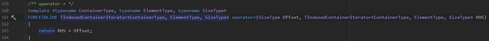
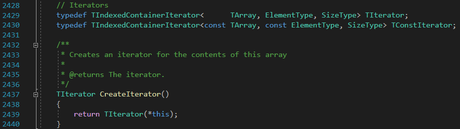

[toc]

## 参考
UE4.26.2 源码

## Array.h
首先定义了迭代器 `TIndexedContainerIterator`，和一些常用的操作符。文件后面补充了运算符的运算规则和一些迭代器操作（有意思的是后面还提供了类似stl的接口，如首字母小写的函数begin、end等，并注释让用户不要直接使用）

然后定义了`TDereferencingIterator`，和`TCanMoveTArrayPointersBetweenArrayTypes::Value`，用途看命名。

进来TArray类，TArray是UE4中的可扩展数组容器，类似std::vector，类的定义如下。第一个模板参数是存储的元素类型，第二个参数是内存构造器的类型。用allocator构造容器也是stl中常用的套路。`TChooseClass` 是用来选择类型的开关。

### 成员变量

### 构造

构造方式提供了默认初始化，从指向数组的指针构造，从初始化列表构造，和一些拷贝构造、移动构造。

### 重载运算符

赋值运算符提供了从 `TArrayView` 到`TArray`的方法

### 查询

查询主要提供了两个函数`Find` 和`Contain`

### 插入

插入操作都会进入这个函数。两个传参分别表示要插入的位置和插入的数量，该函数并不会进行构造函数的操作，只会申请空间。实际的操作分为两步

- 检查数组长度，若不够则扩展
- 最后一行函数的调用。将插入位置后面的内存移动Num（插入数量）个位置。在操作上使用memory move或者placement new。

插入操作提供了一些便利操作，比如通过初始化列表插入。

### 移除

移除操作接口。第一个参数是要移除的下标，第二个是要移除的数量，第三个为true 则删除元素后收缩数组容量。操作上先析构要移除的元素，然后把后续的内存拼接上来。

有个细节就是在简单的移除操作中，bAllowShrinking默认为true。

后续又补充了`RemoveAtSwapImpl` 接口，该接口实现上与移除操作差不多，但是该接口更快，也不保证移除后的TArray顺序。要点在于下图标识出来的那一行，简单的`RemoveAt` 操作只是粗暴地将后续内存拼接上来，而在`RemoveAtSwapImpl`中，当Count为较小值时，会将数组末尾Count个元素复制过来，减少了复制的个数。

### 添加

在原数组上保留一定的空间后，后接要拼上来的数组。方便的是提供了`+=`操作符。还提供了一些接口如`Append`、`Add`接口里面也是调用Append、`Emplace`

此外，TArray还支持类似unique操作，但是因为用的是数组，所以当set用时效率低下。这里展示unique相关操作的接口

### 其他操作

#### RemoveAll

该函数传入谓词，然后根据谓词移除所有符合的元素，并保持元素的相对顺序不变。大致思路如下：

WriteIndex用于记录剩下的所有元素个数。从RunStartIndex到ReadIndex之间都是要处理的区间，长度为RunLength。该过程核心在于`NotMath == !Predicate(GetData()[ReadIndex])` 和 `NotMatch = !NotMath`。

- 首先初始化NotMath，NotMath表示的是该区间段的元素状态，即符不符合谓词规则。
- 然后进入循环do-while大循环，开始更新RunStartIndex，和ReadIndex。`NotMath == !Predicate(GetData()[ReadIndex])` 判断的是与首元素（RunStartIndex）相同bool值的元素，同时该bool值代表该区间的bool状态。即该过程是获取连续的相同bool值区间。
- 然后进入if-else判断，根据bool值去处理区间是合并或者移除。
- 最后这个 `NotMatch = !NotMath`。在第二步的获取区间的小循环那里，只有两种情况会跳出while：遍历结束或者与该区间的bool不相同。如果是遍历结束就会跳出大循环，区间bool值不相同的话就翻转bool值 `NotMatch = !NotMath` 继续do-while循环。

#### FindItemByClass

提醒一下对于TArray<UObject*> 有该函数可用

#### 重写operator new

其他就一些`MemoryImage`，`Implicit heaps` 的操作，后者基本是通过调用`Algo` 和`AlgoImpl`实现的，就不展开介绍了。

