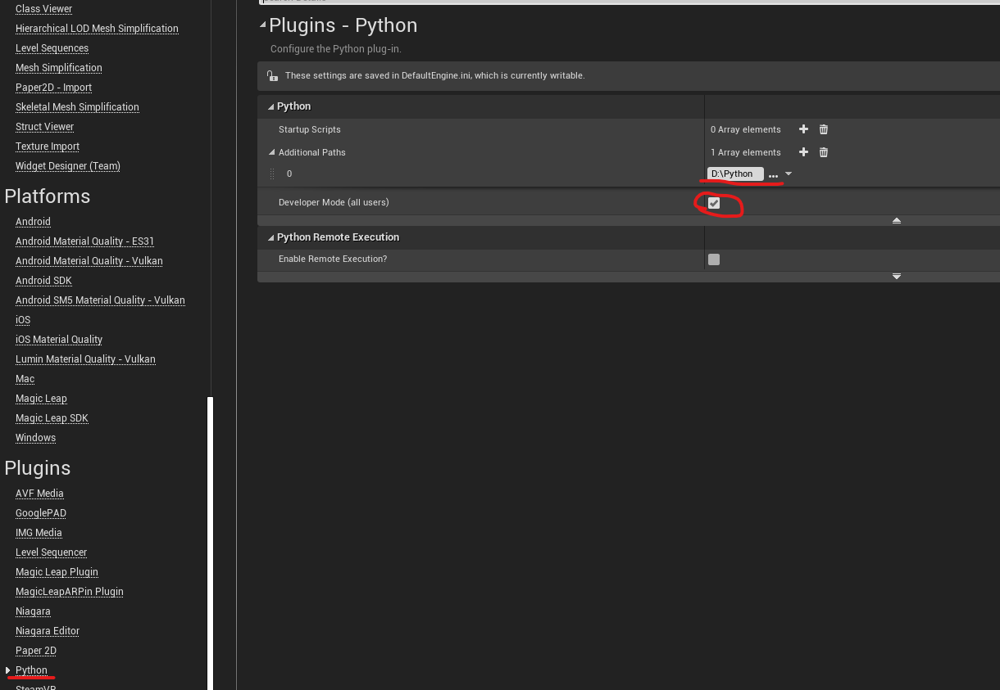
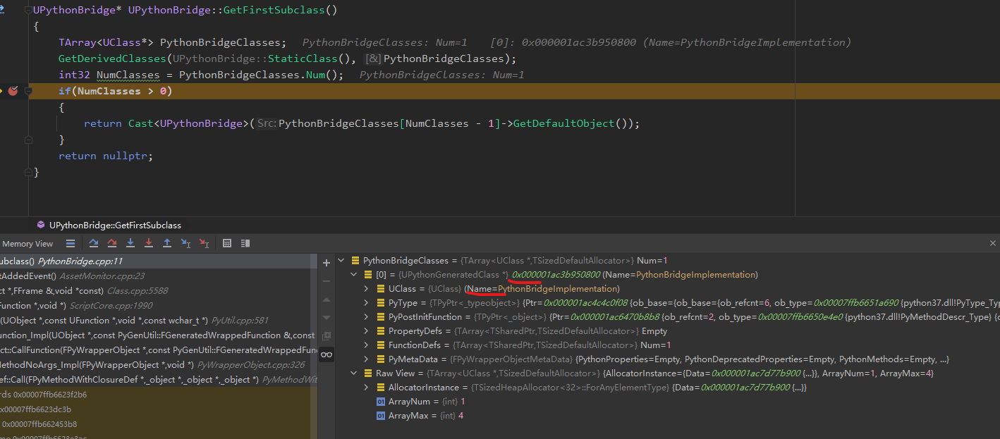

[toc]

# 参考

[使用Python脚本化运行编辑器](https://docs.unrealengine.com/4.27/zh-CN/ProductionPipelines/ScriptingAndAutomation/Python/)
[资源注册表](https://docs.unrealengine.com/4.27/zh-CN/ProgrammingAndScripting/ProgrammingWithCPP/Assets/Registry/)
[Running a Python script with C++](https://forums.unrealengine.com/t/running-a-python-script-with-c/114117/3)
[《InsideUE4》UObject（十三）类型系统-反射实战](https://zhuanlan.zhihu.com/p/61042237)

# 创建启动脚本

启动插件 `Python Editor Script Plugin`
新建文件 `init_unreal.py`


**自定义文件路径**
这里我选择自定义路径 `D:\Python`
然后打开UE编辑器


> 这里如果勾选开发者模式，则在项目文件夹下的 `Intermediate/PythonStub`里会出现unreal.py文件，建议api参考该文件，官方网址指示的api不完整，比如函数unreal.new_object() 网址上就没有

编写以下脚本

```py
import unreal
print('Hello >>>>>>>>>>>>>>')
```

编译UE可得到log


**日志**


# 使用Python监控资源操作

已知可以通过资源管理模块给资源加载添加回调，具体参考[资源注册表](https://docs.unrealengine.com/4.27/zh-CN/ProgrammingAndScripting/ProgrammingWithCPP/Assets/Registry/)
这里想把资源处理过程放在Python 脚本上，但是在Python 中创建的对象会随着脚本执行结束而销毁，所以就算把Python 函数对象绑定在资源加载的回调上，在回调的时候也会因为找不到Python 的函数对象！

有个思路就是在回调的c++ 函数中显式执行 python脚本，但是在该需求中需要传类型为FAssetData的参数，而执行Python脚本的参数只能设为string。

所以这里采取的办法是利用反射。在C++ 中新建 `PythonBridge` 类继承于 `UObject`，里面实现蓝图抽象函数，和一个静态函数，用来获取子类，然后在Python 上实现该子类和抽象函数！这样在需要调用的时候，获取 `PythonBridge` 的子类并执行相应函数。这样回调时所使用的对象是在C++ 中创建的，生命周期由 C++ 把控。

## 新建PythonBridge 类

.h

```cpp
/**
 * Python 可继承的基类
 */
UCLASS(Blueprintable)
class MYPROJECT_API UPythonBridge : public UObject
{
	GENERATED_BODY()
public:
	// 返回第一个继承的子类
	UFUNCTION(BlueprintCallable)
	static UPythonBridge* GetFirstSubclass();

	UFUNCTION(BlueprintCallable, BlueprintImplementableEvent)
	void AssetImplementedInPython(const FAssetData& AssetData);
};
```

.cpp

```cpp
UPythonBridge* UPythonBridge::GetFirstSubclass()
{
	TArray<UClass*> PythonBridgeClasses;
	GetDerivedClasses(UPythonBridge::StaticClass(), PythonBridgeClasses);
	int32 NumClasses = PythonBridgeClasses.Num();
	if(NumClasses > 0)
	{
		return Cast<UPythonBridge>(PythonBridgeClasses[NumClasses - 1]->GetDefaultObject());
	}
	return nullptr;
}
```

## Python 继承PythonBridge 类

注意Python 的函数命名，参考[使用Python脚本化运行编辑器](https://docs.unrealengine.com/4.27/zh-CN/ProductionPipelines/ScriptingAndAutomation/Python/)中的 `关于虚幻编辑器Python API`
在 `init_unreal.py` 中编写

```py
import unreal as ue

@ue.uclass()
class PythonBridgeImplementation(ue.PythonBridge):

    @ue.ufunction(override = True)
    def asset_implemented_in_python(self, assetData):
        ue.log_error("Wow, This is the BEST>>>>>>>>>")
        ue.log(assetData)
```

## 新建资源操作监听类 AssetMonitor

用以启动资源操作监听，因为该类只是作为启动，所以定义为静态类
AssetMonitor.h

```cpp
UCLASS(Blueprintable)
class MYPROJECT_API UAssetMonitor : public UObject
{
	GENERATED_BODY()

public:
	UFUNCTION(BlueprintCallable)
	static void RemoveAssetAddedEvent();

	UFUNCTION(BlueprintCallable)
	static void AddAssetAddedEvent();
};
```

.cpp 这里的RemoveAll 的注释文末有解释

```cpp
void UAssetMonitor::RemoveAssetAddedEvent()
{
	FAssetRegistryModule& AssetRegistryModule = FModuleManager::LoadModuleChecked<FAssetRegistryModule>("AssetRegistry");
	IAssetRegistry::FAssetAddedEvent& AddedEvent = AssetRegistryModule.Get().OnAssetAdded();
	AssetRegistryModule.Get().OnAssetAdded().RemoveAll( UPythonBridge::GetFirstSubclass() );
}

void UAssetMonitor::AddAssetAddedEvent()
{
	FAssetRegistryModule& AssetRegistryModule = FModuleManager::LoadModuleChecked<FAssetRegistryModule>("AssetRegistry");
	IAssetRegistry::FAssetAddedEvent& AddedEvent = AssetRegistryModule.Get().OnAssetAdded();

	UPythonBridge* Bridge = UPythonBridge::GetFirstSubclass();
	//AddedEvent.RemoveAll(Bridge);
	// 不可在构造函数添加，否则在.gen 文件中检测不到蓝图抽象函数 FunctionImplementedInPython 的定义
	AddedEvent.AddUObject(Bridge, &UPythonBridge::AssetAddedImplementedInPython);
}
```

## 启动监听

在一开始的启动脚本中，即 `init_unreal.py`中添加以下代码

```py
import unreal as ue

ue.log_warning(__file__ + ' : Begin Asset Monitor')
ue.AssetMonitor.add_asset_added_event()
```

## 完整的Python脚本

```py
import unreal as ue

@ue.uclass()
class PythonBridgeImplementation(ue.PythonBridge):

    @ue.ufunction(override = True)
    def asset_added_implemented_in_python(self, assetData):
        filter(assetData)
        pass

def cast(inObject, outClass):
    try:
        return outClass.cast(inObject)
    except:
        return None
    pass

def filter(assetData):
    obj = assetData.get_asset()

    texture = cast(obj, ue.Texture)
    if texture:
        textureProcess(texture)
        pass

    pass

def textureProcess(texture):
    # 检查命名
    name = texture.get_name()
    if not name.startswith("T_"):
        ue.EditorDialog.show_message("Hint", "Texture names should start with 'T_'", ue.AppMsgType.OK)
        pass

    # 设置属性
    texture.use_legacy_gamma = True
    # ue.log_warning(dir(texture))
    pass

ue.log_warning(__file__ + ' : Begin Asset Monitor')
assetMonitor = ue.new_object(ue.AssetMonitor)
assetMonitor.add_asset_added_event()
```

# 另：将C++ 类UPythonBridge改成单例遇到的问题

## 先说结论

UPythonBridge 不可以做成单例！

## 将UPythonBridge做成单例

下面只是简单展示单例写法并没有什么大错，看看就好

```cpp
// 头文件添加
UCLASS(Blueprintable)
class MYPROJECT_API UPythonBridge : public UObject
{
private:
	static  UPythonBridge* PythonBridgeInstance;
};

//.cpp 内容
UPythonBridge* UPythonBridge::PythonBridgeInstance = nullptr;
UPythonBridge* UPythonBridge::GetFirstSubclass()
{
	if(PythonBridgeInstance)
	{
		return PythonBridgeInstance;
	}

	TArray<UClass*> PythonBridgeClasses;
	GetDerivedClasses(UPythonBridge::StaticClass(), PythonBridgeClasses);
	int32 NumClasses = PythonBridgeClasses.Num();
	if(NumClasses > 0)
	{
		PythonBridgeInstance = Cast<UPythonBridge>(PythonBridgeClasses[NumClasses - 1]->GetDefaultObject());
	}
	return PythonBridgeInstance;
}
```

## 这时候就会产生一个问题

如果修改Python 子类 `PythonBridgeImplementation` 中重写的抽象函数内容，需要重新编译UE编辑器才能生效。

## 原因

经过漫长调试后，原因很简单！修改Python类 `PythonBridgeImplementation`后，重新编译运行会产生新的子类，而此时单例模式下，该单例指向的地址是旧的！
这里贴几张不是单例的情况下的debug图，分别是第一次运行程序截图，再次执行脚本截图（不修改），再次执行脚本截图（不修改）



会发现，每次执行新的Python 脚本，不是修改子类 `PythonBridgeImplementation` 的变化内容，而是创建新的子类！而旧的UClass会被销毁！

## 结论补充

现在回头看 c++ 资源操作监听类的实现，会发现这里的RemoveAll 是没用的，因为Bridge 是新的类了

```cpp
void UAssetMonitor::AddAssetAddedEvent()
{
	//AddedEvent.RemoveAll(Bridge);
}
```

# 拓展
## 通过脚本读取配置设置默认参数
asset_attribute_config.ini文件
```
[Texture]
use_legacy_gamma = 1
compression_settings = 1
```
AssetRead.py文件
```py
import configparser
import unreal as ue

# configSection_configKey
enum_table = {
    'Texture_compression_settings': {
        0: ue.TextureCompressionSettings.TC_DEFAULT,
        1: ue.TextureCompressionSettings.TC_NORMALMAP,
        2: ue.TextureCompressionSettings.TC_MASKS,
        3: ue.TextureCompressionSettings.TC_GRAYSCALE,
        4: ue.TextureCompressionSettings.TC_DISPLACEMENTMAP,
        5: ue.TextureCompressionSettings.TC_VECTOR_DISPLACEMENTMAP,
        6: ue.TextureCompressionSettings.TC_HDR,
        7: ue.TextureCompressionSettings.TC_EDITOR_ICON,
        8: ue.TextureCompressionSettings.TC_ALPHA,
        9: ue.TextureCompressionSettings.TC_DISTANCE_FIELD_FONT,
        10: ue.TextureCompressionSettings.TC_HDR_COMPRESSED,
        11: ue.TextureCompressionSettings.TC_BC7,
        12: ue.TextureCompressionSettings.TC_HALF_FLOAT,
        13: ue.TextureCompressionSettings.TC_REFLECTION_CAPTURE,
    }
}

class asset_read:
    def __init__(self, iniPath) -> None:
        self.asset_config = configparser.ConfigParser()
        self.asset_config.read(iniPath)
        pass

    # 配置表规则：
    # val 只有两种类型，int，str
    # 数字的全转为 int，str 的则保留 str，传参为枚举型没找到int -> EnumEntry的简便方法，暂自行补充映射
    def __get_val(self, val):
        try:
            return int(val)
        except:
            return val

    def get_items(self, sectionName):
        config = self.asset_config.items(sectionName)

        ret = list()
        for item in config:
            key = item[0]
            val = self.__get_val(item[1])

            enum_table_name = sectionName + "_" + key
            if enum_table_name in enum_table:
                ret.append((key, enum_table[enum_table_name][val]))
            else:
                ret.append((key, val))
        return ret
```
init_unreal.py
```py
import unreal as ue
import AssetRead

@ue.uclass()
class PythonBridgeImplementation(ue.PythonBridge):

    @ue.ufunction(override = True)
    def asset_added_implemented_in_python(self, assetData):
        filter(assetData)
        pass

def cast(inObject, outClass):
    try:
        return outClass.cast(inObject)
    except:
        return None
    pass

def filter(asset_data):
    obj = asset_data.get_asset()
    global asset_class_info_map
    exec_func = asset_class_info_map[type(obj)]
    if exec_func and exec_func(asset_data): pass
    pass

ue.log_warning(__file__ + ' : Begin Asset Monitor')

# 读取配置
asset_config = AssetRead.asset_read('D:/Python/asset_attribute_config.ini')
texture_config_items = asset_config.get_items('Texture')

# 绑定回调
ue.AssetMonitor.add_asset_added_event()

#===============================================处理函数=======================================================#
def texture_process(asset_data):

    obj = asset_data.get_asset()
    obj_path = asset_data.object_path # 获取资源路径

    ue.EditorAssetLibrary.set_metadata_tag(obj, "Author", "shuizhidaoniaaa") # 设置资源的 metadata
    metadata_map = ue.EditorAssetLibrary.get_metadata_tag_values(obj) # 获取资源的 metadata

    texture = cast(obj, ue.Texture)
    # 检查命名
    name = texture.get_name()
    if not name.startswith("T_"):
        # 弹窗提示
        ue.EditorDialog.show_message("Hint", "Texture names should start with 'T_'", ue.AppMsgType.OK)
        pass

    # 读配置设置属性
    global texture_config_items
    for item in texture_config_items:
        # object 无法通过下标赋值，否则报错 object does not support item assignment
        setattr(texture, item[0], item[1])
        pass
    
    pass

# 枚举处理函数，被 filter 使用
asset_class_info_map = {
    ue.Texture2D: globals()['texture_process']
}
```

# 关于脚本插件BUG
对于更改import 的文件内容，有时候改动会没有生效，简而言之就是遇到奇奇怪怪的报错，先试试重启UE编辑器