<!--
 * @Author: caizehui 905718992@qq.com
 * @Date: 2022-06-20 23:44:43
 * @LastEditors: error: git config user.name && git config user.email & please set dead value or install git
 * @LastEditTime: 2022-07-19 23:58:07
 * @Description: 
 * 
-->
# UnrealEngine关卡流送与HLOD
该章学习关卡流送的实现，并开启 HLOD

## 参考教程
官方
[关卡流送总览](https://docs.unrealengine.com/4.27/zh-CN/BuildingWorlds/LevelStreaming/Overview/)
[关于关卡的基本操作](https://docs.unrealengine.com/4.27/zh-CN/BuildingWorlds/LevelStreaming/HowTo/)
[使用蓝图加载关卡](https://docs.unrealengine.com/4.27/zh-CN/BuildingWorlds/LevelStreaming/HowTo/StreamWithBlueprints/)
[使用关卡流送体积流送子关卡](https://docs.unrealengine.com/4.27/zh-CN/BuildingWorlds/LevelStreaming/HowTo/StreamWithVolumes/)
[HLOD](https://docs.unrealengine.com/4.27/en-US/BuildingWorlds/HLOD/)

博客
[使用关卡流送体积](https://blog.csdn.net/lei_7103/article/details/97007203)

## 关卡流送介绍
关卡流送有两种方式
- 自主控制关卡的加载和卸载
- 使用关卡流送体积实现关卡的自动加载和卸载

**关卡流送体积的注意**
- 所有关卡流送体积(Level Streaming Volum)都必须存在于固定关卡中。存在于其他关卡内的关卡流送体积不可用于关卡流送，并在检查地图错误时生成警告
- 如果一个关卡具有关联的流送体积，则该关卡的其他流送方法将无法正确工作
- 一个关卡流送体积可以影响多个关卡。类似地，一个关卡也可以受多个关卡流送体积影响
- 基于体积的流送可用于分割屏幕。在发出任何加载/卸载请求前，所有本地玩家的视点（摄像机位置）都将予以考虑

**关卡流送体积的工作**
每个流送关卡都可以关联一组关卡流送体积。每一帧中，引擎会在每一关卡上迭代，并检查玩家的视点（摄像机位置）是否位于与该关卡相关的任何关卡流送体积内。若在，则发出请求以开始加载该关卡，否则关卡将标记为卸载

## 搭建关卡
#### 导入素材
先新建空项目，带标准素材包，后面做HLOD用。开始后随便丢几个静态网格体进去。再添加第三人称素材包，拉个Character到场景中作为观测者，如图在Character的`details`中设置`possess play` 为 `player 0`。开始游戏后就可以操作人物了。
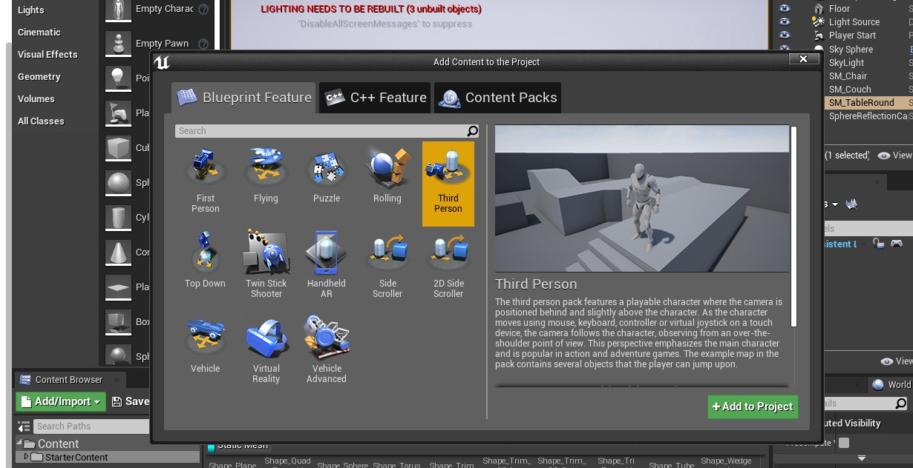
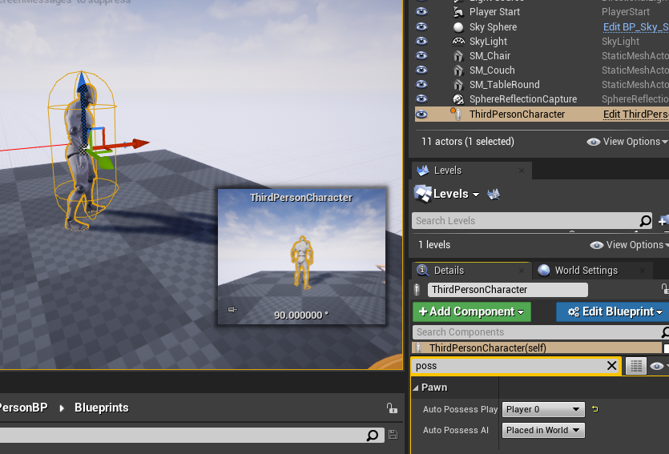

#### 添加关卡
如何添加关卡参照[关于关卡的基本操作](https://docs.unrealengine.com/4.27/zh-CN/BuildingWorlds/LevelStreaming/HowTo/)。
添加两个空关卡，分别命名为Level1，Level2，同时会产生两个同名的地图（更改地图名即可更改关卡名）。如下图所示
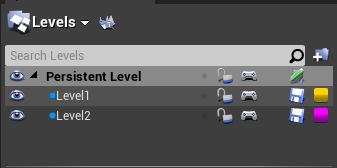
在关卡界面双击`Persistent Level`将关卡切回固定关卡，添加两块Cube，等下分别放置到两个关卡中，如下图所示。这里加上不同贴图以区分。
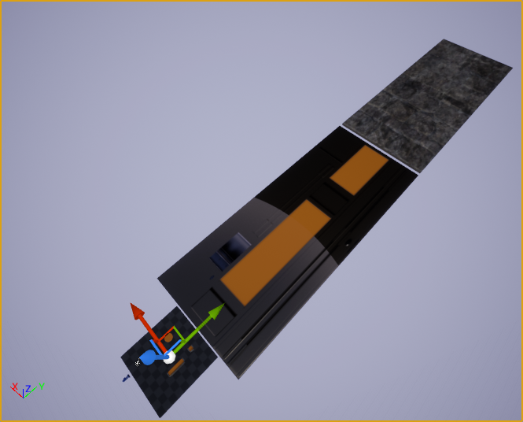
然后在世界窗口单击要移动的cube，在Levels窗口中移动到别的Level去，如下图
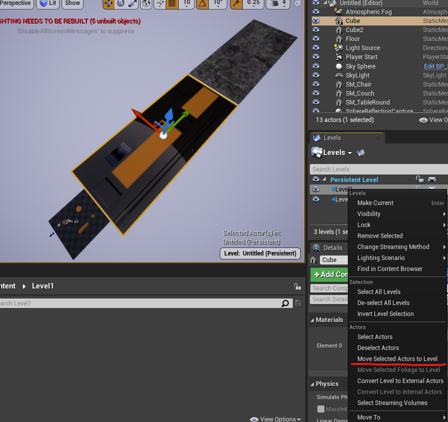

到目前为止关卡就搭建好了。现在点击开始游戏，只能看见固定关卡。
> 此时打开Level1的map，会看到Levels窗口只有固定关卡，也就是说可以实现关卡的嵌套

## 自主控制关卡的加载和卸载
打开关卡蓝图，如下编写脚本，记得打开可视度
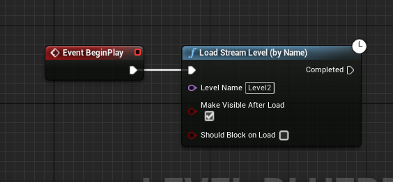
运行后就可以看见Level2 关卡被加载了
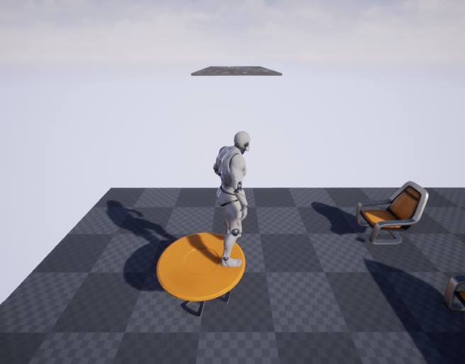

该功能主要用于配合触发盒子等自主加载/卸载关卡

## 使用关卡流送体积实现关卡的自动加载和卸载
删除自主添加的蓝图脚本。因为绑定关卡流送体积后其他流送方法将不会正确工作（可能会触发什么错误？）
先切换回固定关卡！！！
选择关卡流送体积盒放置在场景中，并包裹关卡。盒子要比关卡略大，注意Z轴上的要确保视点（摄像机）能进入体积盒。如下图所示
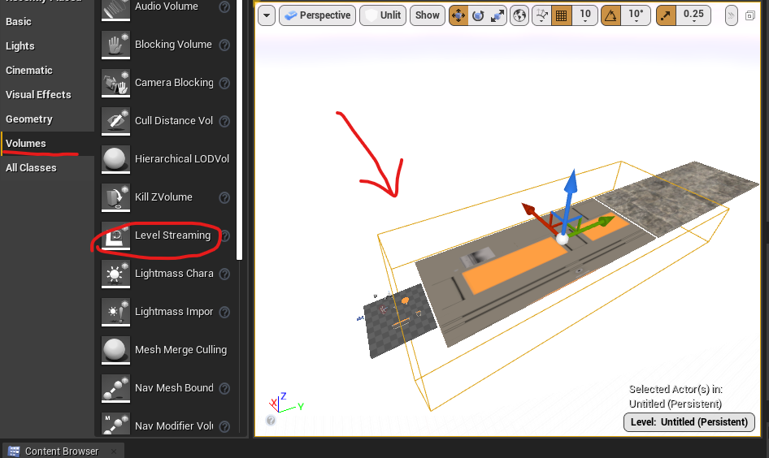

**绑定体积盒与关卡**
打开关卡细节面板，如图。选择要绑定关卡流放体积盒
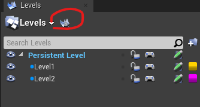
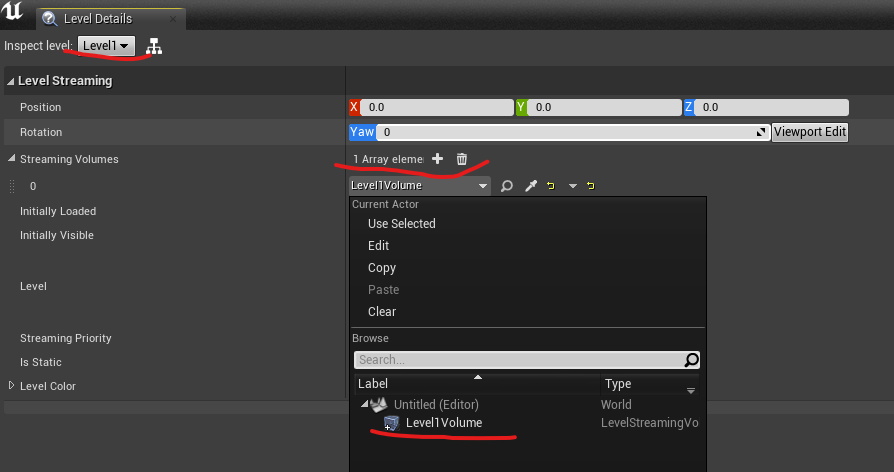
Level2 同样操作，然后运行游戏即可。
最后摆放如图
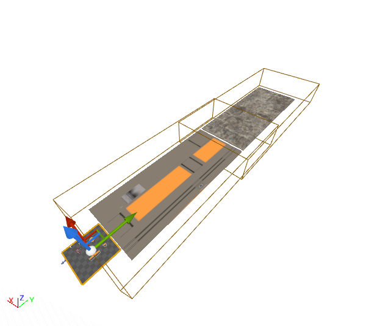
在Level2，走出Level1
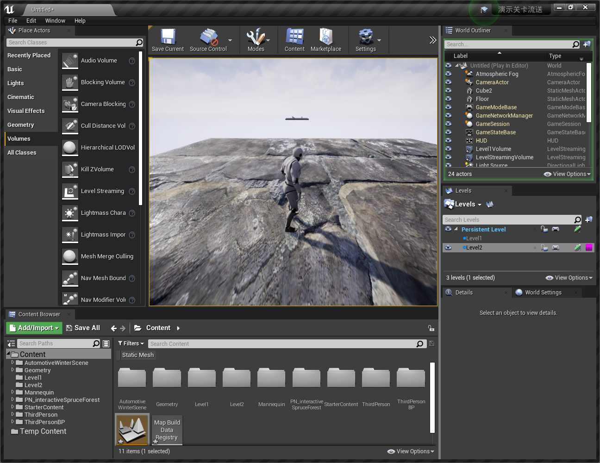

## HLOD
HLOD跟关卡流送并无关联

HLOD教程查看官网的就行，不多。这里简单介绍如何开启HLOD
[HLOD官网教程](https://docs.unrealengine.com/4.27/en-US/BuildingWorlds/HLOD/)

打开world setting，搜索lod并如图打勾
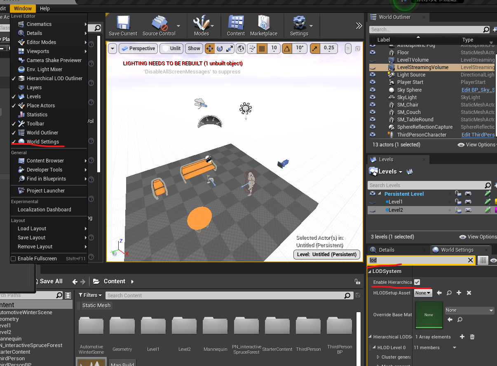
然后就可以打开HLOD并生成了，关于设置细节查看官方教程
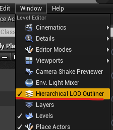
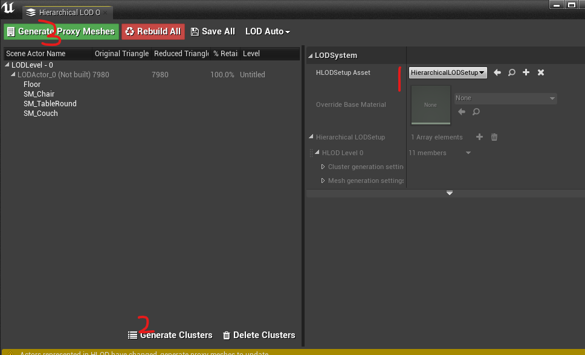

要注意的是，要开启子关卡的HLOD，需要进入子关卡的map，再去设置world setting

对比效果，可以发现白边消失
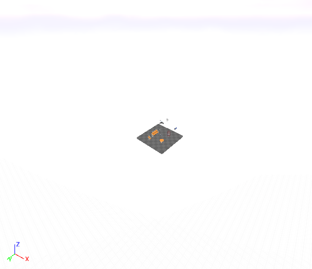
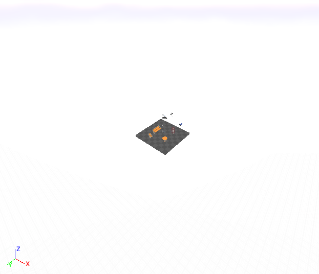