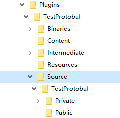

# UnrealEngine插件
该章完成需求：完成项目插件，能够提供自定义的protobuf协议
步骤：编译protobuf，新建插件导入protobuf库并使用，项目工程调用插件开放的接口
## 准备
先把下面官方教程看懂
[插件创建和使用最佳实践-模块和引擎结构](https://learn.unrealengine.com/course/2504894/module/5419430?moduletoken=UHxxnDLPW8TI4hATF7z-VjXcOoq6lY7968PN5GzFToXVmIfcqBSKFC8VUrzqw-K5&LPId=0)
[模块](https://docs.unrealengine.com/4.26/zh-CN/ProductionPipelines/BuildTools/UnrealBuildTool/ModuleFiles/)
[第三方库](https://docs.unrealengine.com/4.26/zh-CN/ProductionPipelines/BuildTools/UnrealBuildTool/ThirdPartyLibraries/)
[游戏模块](https://docs.unrealengine.com/4.26/zh-CN/ProgrammingAndScripting/GameplayArchitecture/Gameplay/)

注意事项
[UE4 调试第三方库相关问题](https://blog.csdn.net/mrbaolong/article/details/114947090)

**要点**
模块是UE4的构建块。引擎是以大量模块的集合形式实现的，游戏提供自己的模块来扩充自己。

模块是通过C#源文件声明的，扩展名为.build.cs

UE4编译器默认不支持使用`debug`版本的第三方库。（默认选项可改）

默认生成的运行库选项为`/MD`，即`多线程Dll[/MD]`。若链接库出现`XXX不匹配项: 值“0”不匹配值“2”`，多半为运行库版本错误
> 多线程[/MT]:0
多线程调试[/MTd]:1
多线程DLL[/MD]:2
多线程调试DLL[/MDd]:3

## 小试牛刀
连接mysql库 [unreal连接mysql](https://blog.csdn.net/shuizhidaoniaaa/article/details/120132778?spm=1001.2014.3001.5501)

## 编译protobuf

*坑点：protobuf 按照 README 编译出来的是 lib 静态库，网上大部分编译教程也是/MT 版本*

参照[protobuf编译](https://blog.csdn.net/shuizhidaoniaaa/article/details/119536343?spm=1001.2014.3001.5501)
用cmake-gui生成vs工程，注意生成时勾选的选项，runtime=off，test=off, shared_lib=on，之后编译生成libprotobuf.dll即可

## 编写插件
先写个简单插件，熟练的同学直接在文件管理器里面构建文件层次，从头编写文件，不熟练的打开ue编辑器，Edit->Plugins->New Plugin->Blank建空插件，我这里命名为TestProtobuf。建完先跑一下，跑通就ok


在Public文件夹下新建文件夹Include，Library（图方便，建哪里都ok），里面丢相应的东西

添加下面两行到build.cs文件。注意这里库没有拷贝到Binaries文件夹下，不适用打包发布。
```cs
PublicIncludePaths.Add(Path.Combine(ModuleDirectory, "Private", "Include"));
PublicAdditionalLibraries.Add(Path.Combine(ModuleDirectory, "Private", "Library", "libprotobuf.lib"));
```

> PS:文件夹位置跟实际的的私有包含和公有包含无关，只是为了规范才将私有文件放在Private文件夹下，公有的放在Public文件夹下。可以做个test：在Public文件夹下，将protobuf源码的google文件夹与生成的pb.h文件放在同级目录下，在Build.cs文件中使用PrivateIncludePaths.Add()，此时也能通过编译

*坑点：生成的 ph.h用的是<>，用PrivateInclude..后，如果 ph.cc与 google文件夹的相对位置有问题会产生许多麻烦*

*坑点：有时候编译后会报外部符号链接错误，特点是 StartupModule的函数错误。因为导出库要在class后面加 PLUGINNAME_API，否则使用插件会链接不到。要谨记模块会编译成库*

下面随便写点做test，类只添加了一个函数
TestData.proto
```txt
syntax = "proto3";

message Account {
    string name = 1;     // 账户名字
    string password = 2;     // 密码
    int32 loginType = 3;     // 登陆类型，0注册 1登陆
}
```

```cpp
class TESTPROTOBUF_API FTestProtobufModule : public IModuleInterface
{
public:

	/** IModuleInterface implementation */
	virtual void StartupModule() override;
	virtual void ShutdownModule() override;
	void SetAccount(const FString& name, const FString& password, const int32& loginType);
	Account account;
};
```
```cpp
void FTestProtobufModule::SetAccount(const FString& name, const FString& password, const int32& loginType)
{
	account.set_name(TCHAR_TO_ANSI(*name));
	account.set_password(TCHAR_TO_ANSI((*password)));
	account.set_logintype(loginType);
}
```

## 测试
此时插件就编写好了。先在项目的build.cs里面导入模块。这里沿用上面小试牛刀里mysql的例子，在蓝图库里里面测试
```cpp
UCLASS()
class TESTPLUGIN_API UMyBlueprintFunctionLibrary : public UBlueprintFunctionLibrary
{
	GENERATED_BODY()
public:
	UFUNCTION(BlueprintCallable, Category="MySQL")
	static bool TestMySQL();

	UFUNCTION(BlueprintCallable, Category="MySQL")
	static void TestProtobuf();
};
```
```cpp
void UMyBlueprintFunctionLibrary::TestProtobuf()
{
	FTestProtobufModule ProtobufModule;
	ProtobufModule.SetAccount("hui", "test", 0);
}
```

*坑点：如果protobuf库错误，先想到有没有参照 [protobuf编译](https://blog.csdn.net/shuizhidaoniaaa/article/details/119536343?spm=1001.2014.3001.5501)，添加`#define PROTOBUF_USE_DLLS`*