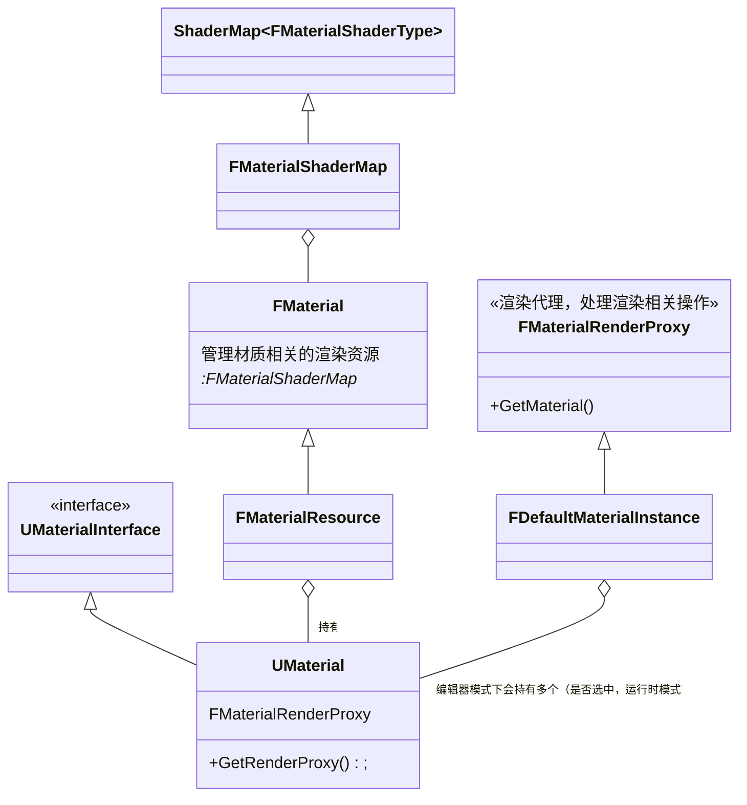

[toc]

## UObject
UObject类提供了以下功能
- 垃圾收集
- 引用自动更新
- 反射
- 序列化
- 自动检测默认变量的更改
- 自动变量初始化
- 和虚幻引擎编辑器的自动交互
- 运行时类型识别
- 网络复制

UObject类会在引擎加载阶段，创建Default Object默认对象。所以

- 构造函数并不是在游戏运行时调用，即使只有一个UObject对象在场景中，构造函数还是会被调用两次。
- 构造函数被调用时，UWorld不一定存在，GetWorld() 返回值有可能为空

可以通过AddToRoot函数来让一个UObject一直不被回收。

## 模板
模板允许在C++层提供一个类，并实现StartupModule与ShutdownModule函数，从而自定义模板加载与卸载过程中的行为。

总体上来说，模块的加载大致为以下顺序：
- Platform File Module，因为虚幻引擎要读取文件
- 接下来是加载核心模块（FEngineLoop::PreInit -> LoadCoreModules)
- 加载CoreUObject
- 然后在初始化引擎前加载模块FEngineLoop::LoadPreInitModules
- 加载Engine
- 加载Renderer
- 加载AnimGraphRuntime

## UBT（Unreal Build Tool）
UBT的工作分为三个阶段
- 收集信息。UBT收集环境变量、引擎源码目录，工程目录等一系列的信息
- 参数解析。解析传入的命令行参数，确定自己需要生成的目标类型
- 实际生成。根据环境和参数，生成makefile，确定C++各种目录的位置。最终开始构建整个项目。此时编译工作交给标准C++编译器。

## WinMain函数链接到.exe文件
 .target.cs文件控制Launcher模块不被编译为DLL。
 在UEBuildEditor.cs的`SetupBinaries`中，`BuildRules`类在设置好自己的二进制数据输出后，`OutBuildBinaryCongfiguration`数组会添加一个特殊成员：Launcher模块会被设置为`UEBuildBinaryTypes.Executable`添加进来，作为.exe文件的包含模块

## UHT（Unreal Header Tool）
模块在Programs下的UnrealHeaderTool。在.build.cs文件中可看到UHT依赖模块`Core, CoreUObjects, Json, Projects`。最后生成.exe文件。UHT的Main函数在UnrealHeadToolMain.cpp文件中，并且通过`IMPLEMENT_APPLICATION`声明了这是个独立应用程序。
**大致工作流程**
- 调用GEngineLoop->PreInit 函数，初始化Log、文件系统等基础系统。从而允许接祖UE_LOG宏输出log信息
- 调用UnrealHeaderTool_Main函数，执行真正的工作内容
- 调用FEngineLoop::AppExit 退出

**UHT干了什么**
UBT会生成.manifest文件，然后通过命令行参数告诉UHT，游戏模块对应的定义文件位置。
.manifest文件包含了所有Module的编译相关的信息。
然后UHT开始自身的三遍编译：Public Classes Headers, Public Headers, Private Headers。第一遍是兼容虚幻3的代码。后两遍是解析头文件定义并生成C++代码。生成的代码会和现有代码一起联合编译以产生结果。
经过UHT编译，生成.generated.cpp和.generated.h两种文件。这两种文件将C++类与UClass中对应的“Property数据类型”和“Function数据类型”绑定起来。

> 注：从功能上解释，这两种文件的功能之一就是实现C++的反射。文件内容记录了类的相关信息。
C++实现反射的其中一个思路可以是，通过static全局变量（在main之前运行），收集类信息（注册，实际上也可以是延迟注册），以便程序运行时使用。利用空的宏定义，如UClass()，作为标识区分类，函数，变量等。

## 内存分配
Windows平台提供了标准的Malloc（ANSI）、Intel TBB内存分配器、Binned内存分配器三个方案，对应函数为
```cpp
FMalloc* FWindowsPlatformMemory::BaseAllocator
```

## 引擎初始化
初始化分为PreInit和Init
**预初始化内容**
- 设置程序工作路径
- 设置标准输出：设置GLog系统输出的设备

还初始化部分系统，包括：
- 将当前线程GameThread设置为游戏主线程
- 初始化随机数系统
- 初始化TaskGraph任务系统。同时启动专门的线程池。

预初始化过程也会判断引擎的启动模式：游戏模式还是服务器模式等。
完成这些后，调用LoadCoreModules（这里指CoreUObject）。随后启动所有`PreInitModules`，包括引擎模块、渲染模块、动画蓝图、Slate渲染模块、Slate核心模块、贴图压缩模块和地形模块。
这些模块加载完后，调用AppInit()，进入初始化。
**初始化**
此时所有被加载到内存的模块中的PostEngineInit函数，会被IProjectManager调用
**主循环**
虚幻引擎的渲染线程是独立更新的。

## 对象模型
### UObject对象
通过NewObject 模板函数生成UObject对象。
UObject的构造粗略分为以下几步
- 根据类对象大小获取分配的内存区域的首指针
- 根据该类反射生成的.generated.h，获取类信息`FObjectInitializer`
- 以`FObjectInitializer`作为参数调用构造函数，配合UClass的“构造函数指针（`__DefaultConstructor`）”进行PlacementNew

关于第二步，有两个问题，首先是构造函数指针。实际上是无法直接获得类的构造函数指针的，该指针指向的是一个静态函数，传参为`FObjectInitializer`，然后将`FObjectInitializer`作为参数调用构造函数，执行PlacementNew，完成构造。
第二个问题是为什么不直接使用PlacementNew？如果直接使用PlacementNew，必然需要传入类型参数作为模板参数，这不符合需求。同时`__DefaultConstructor`可被复用。
总之这种构造方法实现了根据反射生成的类信息去构造UObject。这也是为什么不能直接给构造函数传递参数，因为`__DefaultConstructor`只有一个形参。

#### 序列化
序列化/反序列化的过程是一个“步骤”，即需要先实例化一个对象，然后通过反序列化的方式读出对象。
实例化一个对象之后，传递FArchive参数调用反序列化函数，过程如下：
- GetClass获取当前类信息，GetOuter获取Outer。该Outer的作用理解为，当前Object作为Outer 的子对象进行序列化。
- 判断当前等待序列化的对象类UClass的信息是否被载入，没有的话：预载入当前的类信息，预载入当前类的默认对象CDO 的信息
- 载入名字，Outer，当前对象的类信息，保存于ObjClass对象中
- 在类信息加载之后（确定有哪些脚本成员变量需要加载），载入对象的所有脚本成员变量信息。对应函数为`SerializeScriptProperties`
- - 调用`FArchive::MarkScriptSerializationStart`，标记脚本数据序列化开始
- - 调用ObjClass对象的`SerializeTaggedProperties`，载入脚本定义
的成员变量；
- - 调用MarkScriptSerializationEnd标记脚本数据序列化结束

引擎序列化每个继承自UClass的类的默认是（即序列化CDO），然后序列化对象与类默认对象的差异。这样就节约了大量子对象序列化后的存储空间。

要点：
- 序列化必要的、差异性的数据
- 先模塑对象，再还原数据

#### 销毁
UObject对象无法手动释放，只能手动请求`ConditionalBeginDestroy`来完成销毁。实质上BeginDestroy函数只是设置了当前UObject的RF_BeginDestroyed为真，然后通过SetLinker函数将当前对象从linker导出表中清除。
**触发销毁**
典型的情况是垃圾回收器来触发销毁。垃圾回收器执行两个步骤：析构和回收内存。
**垃圾回收**
垃圾回收算法除了引用计数外，常用的还有追踪式GC，即查找整个对象的引用网络，回收没有包含在引用网络内的对象。
垃圾回收过程对应函数`FRealtimeGC::PerformReachablilityAnalysis`。回收的大致思路为：
- 锁定
- - 回收
- - - 标记
- - - - 全标记为不可达
- - - - 遍历对象引用网络来标记可达对象
- - - 清除
- 解锁

**基于簇的垃圾回收**
引擎采用基于簇的垃圾回收，用于加速cook后对象的回收。当簇根不可达，整个簇都会被回收。

### Actor对象
Actor对象通过SpawnActor函数生成。该函数只能从UWorld调用。
在SpawnActor中，实际生成Actor对象如下。Outer为Level，即Actor由当前关卡负责存储信息。
```cpp
	AActor* const Actor = NewObject<AActor>(LevelToSpawnIn, Class, NewActorName, ActorFlags, Template, false/*bCopyTransientsFromClassDefaults*/, nullptr/*InInstanceGraph*/, ExternalPackage);
```
生成Actor之后添加Actor到当前关卡的Actor列表中，然后调用PostSpawnInitialize,如下。
```cpp
	Actor->PostSpawnInitialize(UserTransform, SpawnParameters.Owner, SpawnParameters.Instigator, SpawnParameters.IsRemoteOwned(), SpawnParameters.bNoFail, SpawnParameters.bDeferConstruction);
```
进入函数后设置了以下内容（可能因版本不同改变）
- 设置当前Actor的Owner
- 获取Actor根组件以计算Actor的位置。
- 调用`DispatchOnComponentsCreated` 函数，从而调用所有之前
通过`CreateDefaultSubobject`函数构造出来的组件的
`OnComponentCreated`函数。
- 通过`RegisterAllComponents`注册所有的Actor组件。实质上调用
组件的`RegisterComponent`函数。
- 调用`PostActorCreated`函数，通知当前Actor已经生成完成。
在Actor中，这个函数只是一个空函数，开发者可以根据自己
的需求在这里进行处理。
- 调用`FinishSpawning`。
- - 调用`ExecuteConstruction`。如果当前Actor继承自蓝图Actor类，此时会拉出所有的蓝图父类串成一串，然后从上往下调用蓝图构造函数（此时顺便也会把Timeline组件生成出来）。最后调用用户在蓝图定义的构造函数脚本。
也就是说，在蓝图中书写的构造函数实际上不是在构造阶段被调用。最后调用虚函数`OnConstruction`,通知C++层，当前脚本构造已经完成。开发者可以重载该函数，介入这一过程。
- - 调用`PostActorConstruction`，该函数主要处理了组件的初始化过程。蓝图也有可能创建自己的组件，因此直到这时才获得了所有Actor已经被创建但是还没有初始化的组件，组件的初始化需要放到这里进行
- - - 调用`PreInitializeComponents` 启动输入
- - - 调用`InitializeComponents`初始化组件
- - - 根据碰撞处理方式生成Actor
- - - 调用`PostInitializeComponents`，设置bActorInitialized为真，想寻路系统注册自己，调用`UpdateAllReplicatedComponents`
- - - 调用`DispatchBeginPlay`,BeginPlay，开始Tick

Actor所属组件会延后到所有组件被注册到世界之后进行。Actor默认的BeginPlay会先调用蓝图的，然后再是C++层的

#### 销毁
Actor的Destroy函数实际上是调用UWorld::DestroyActor 来销毁自身。
- 分离子Actor
- SetOwner(NULL)
- 通知所有组件，从世界取消注册
- 自身及组件使用 MarkPendingKill()
- MarkPackageDirty()
- 取消注册所有ActorTick

## 渲染
引擎在`FEngineLoop::PreInit`中对渲染线程进行初始化。具体位置在`StartRendering`。大致执行了以下内容
- 创建渲染线程类实例
- 通过FRunnableThread::Create 创建渲染线程
- 等待渲染线程准备好从自己的TaskGraph 取出任务并执行
- 注册渲染线程
- 创建渲染线程心跳更新线程

渲染线程的主要执行内容在全局函数`RenderingThreadMain`中,游戏线程会借助EQUEUE_Render_COMMAND系列宏，向渲染线程的TaskMap中添加渲染任务。渲染线程则不断提取这些任务去执行。
渲染线程将渲染命令添加到RHICommandList，也就是RHI命令列表中。由RHI线程不断取出指令，向GPU发送，并阻塞等待结果。此时RHI线程虽然阻塞，但是渲染线程依然正常工作，可以继续处理向RHI命令列表填充指令。

虚幻引擎对于场景中所有不透明物体的渲染方式，就是延迟渲染。而对于透明物体的渲染方式，则是前向渲染（Forward Rendering）

**初始化视口**
在获取场景的渲染目标的后，需要先进行可见性剔除。剔除过程分为：预设置可见性，可见性计算，完成可见性计算。

`渲染架构看书去！！！`（因为渲染我不懂，作者写得好呀）

### 逻辑世界与渲染世界
假设Tick函数所在的线程为游戏线程，负责渲染的函数成为渲染线程：
- 游戏线程遍历所有的逻辑对象，对于每个逻辑对象中可以显示的组件：
- - 创建`SceneProxy`场景代理，完成场景代理初始化
- - `SceneProxy`会根据对象位置等，更新自己勇于渲染的消息
- 在合适的时机受击SceneProxy对象，并创建渲染指令，添加到渲染线程的渲染指令列表末尾
- 渲染线程不断从渲染指令列表中取出渲染指令进行渲染

任何一个可以被渲染的组件，都需要创建一个对应的渲染代理。在`UPrimitiveComponoent`类中提供如下虚函数。重载此函数可引入自己的Shader
```cpp
virtual FPrimitiveSceneProxy* CreateSceneProxy()
```
这个函数将会在组件注册到世界中的时候被调用。而不是每帧都会调用
**渲染代理的更新**
渲染代理的更新分为两部分：静态，通过重载`DrawStaticElements`函数完成；动态，通过重载`GetDynamicMeshElements`完成。
不论是动态还是静态，最终都不是直接对对象进行绘制，而是将Mesh信息传入到传入的`FMeshElementCollector`中，最后由渲染器同一进行渲染。

### 材质
虚幻引擎的渲染系统，尤其是材质系统，实际上是不支持随意定制的。而Custom节点实际上只产生了一个节点，用户无法干涉整个材质的渲染过程。甚至连材质的Shader Model类型都是被写死在虚幻引擎代码中的。
即新增ShadingModel就必须改动源码。仅仅依靠插件无法达到新的着色模型的效果。
**UMaterial**
Material 指持有指向对应材质的引用。
先看父类`UMaterialInterface`，其主要两个功能是编译和提供着色器组合。前者被`CompileProperty`和`CompilePropertyEx`完成，后者是通过`GetRenderProxy`函数返回一个`FMaterialRenderProxy`结构实现
**材质相关C++类关系**

UMaterial用于逻辑线程，FMaterial和FMaterialRenderProxy用于渲染。
- UMaterial 持有逻辑线程相关的材质信息，并作为逻辑线程的访问接口，管理其余两个渲染线程的类
- FMaterial 负责管理渲染资源的类。该渲染资源主要指ShaderMap。其负责ShaderMap的编译等
- FMaterialRenderProxy 渲染代理，负责处理渲染相关操作的类

这三个类加上由FMaterial负责管理的FMaterialShaderMap类（及其子类）共同完成了材质这个数据结构的表达

**编译**
点击材质编辑器的应用或者保存按钮，触发UMaterial的`PostEditChangeProperty` 函数，编译当前材质的节点树，生成着色器缓存`CacheShaders`。编译对应的函数是`BeginCompileShaderMap`。
可以在引擎Engine\Shaders文件夹中找到叫MaterialTemplate.usf的文件，这个就是编译的“模板”。实际上节点图转化为HLSL的过程，就是把这个模板中的一些部分替换为具体表达式。
已经产生的HLSL代码会被处理，得到ShaderMap结构。
**ShaderMap产生**
HLSL代码被生成后需要进入真正的着色器编译。首先要创建ShaderMap实例 NewShaderMap。
材质节点图生成的HLSL代码只是一批函数，并不具备完整的着色器信息。这些代码会被嵌入  到真正的着色器编译环境中，然后重新编译为最终的ShaderMap中的每一个着色器。
这个着色器编译环境对应的类是FShaderCompilerEnvironment。该
类通过MaterialTranslator::GetMaterialEnvironment函数初始化实例，主要
完成以下两个步骤：
- 根据当前材质的各种属性，设置各种着色器宏定义。从而控制编译
过程中的各种宏开关是否启用
- 根据FHLSLMaterialTranslator在解析过程中得出的当前参数集合，
添加参数定义到环境中。

初始化完成后，开始进行实际的编译工作：
- 获取生成的HLSL代码作为“Material.usf”文件，添加到编译环境中。
- 调用NewShaderMap的Compile函数
- - 调用FMaterial::SetupMaterialEnvironment函数，设置当前的编译环境
- - - 通过FShaderUniformBufferParameter::ModifyCompilationEnvironmen，把通用缓存的参数结构定义添加到编译环境中。这个定义是通过CreateUniformBufferShaderDeclaration根据你用到的参数生成的。
- - - 根据曲面细分、混合模式、接收贴画的类型、光照模式设置一系列宏
- -  获取所有的顶点工厂类型（FVertexFactoryType），对每个顶点工厂类型执行以下操作
- - - 赋予顶点工厂对应类型的FMeshMaterialShaderMap*指针MeshShaderMap。
- - - 对当前MeshShaderMap调用BeginCompile。
- - - - 遍历包含所有FShaderType的列表，获取FMeshMaterialShaderType*ShaderType。
- - - - 将没编译的ShaderType加入到编译工作列表SharedShaderJobs中。根据当前的顶点工厂类型，添加工厂定义到编译环境中。调用GlobalBeginCompileShader创建编译任务。设置FShaderCompilerInput实例Input。
- - - - 使用异步着色器编译流水线执行这些着色器编译任务。

## Slate
Slate是一个跨平台的、硬件加速的图形界面框架。
Slate为了实现自适应的相对界面布局，采用了这种思路：
- 先递归计算每个控件的大小，父控件会根据子控件来计算自己的大小。
- 然后根据空间大小，具体计算出每个控件的绘制位置

**Tick**
Slate系统的更新，实质上是与引擎内部更新分开的。FEngineLoop类会首先更新引擎，随后在确保FSlateApplication已经初始化后，调用FSlateApplication的Tick函数进行更新。
FSlateApplication代表了当前正在运行的Slate程序，F开头意味着这个类本身并非一个Slate组件，其只是行使“管理”的责任。
实际行为上，FSlateApplication负责绘制当前窗口。Tick函数被调用时，它会请求更新所有Window，即调用TickWindowAndChildren，随后再回调用Draw系列函数
**Slate的渲染**
Slate对象会先准备需要渲染的内容（WindowElement），然后这些内容交由SlateRHIRenderer负责，最终被绘制。绘制实际上走的是标准的渲染流程：
- 将控件对象转换为需要绘制的图形面片
- 通过PixelShader和VertexShader来使用GPU进行绘制
- 拿回绘图结果，显示在SWindow

Slate的渲染是没有开启审图检测的，而且在SlateVertexShader中，渲染对象的Z轴为0，即
- 控件对象会按照绘制顺序堆叠
- 控件对象不存在“更新区域”的概念，即使被遮盖，也会被绘制

逐空间绘制很低效，引擎采用了ElementBatch（对象批量渲染）的概念，将同一层级的对象同时进行渲染。

## 蓝图
蓝图系统依然是一套依托于虚幻引擎现有UClass、UProperty、UFunction框架，根植于虚幻引擎UnrealScript字节码编译器系统的一套可视化编程系统。这就意味着：
1.  蓝图最终编译结果依然会转化为UClass、UProperty、UFunction信息。其中指令代码将会存储于UFunction的信息中。
2.  蓝图本身可以看作是一种可视化版的UnrealScript，是经过转化和经过语法解析生成的字节码。

蓝图系统实际上由三部分组成：蓝图编辑系统、蓝图本身、蓝图编译后的字节码。最终编译完成的蓝图字节码将不会包含蓝图本身的节点信息。这部分信息存在UEdGraph中。
UEdGraph用于表示蓝图的数据结构，整体结构可看做：
- UEdGraph
- - Schema
- - Nodes
- - SubGraphes

**Schema**
Schema规定了当前蓝图能产生什么样的节点等信息，部分函数的含义列表如下：
- GetContextMenuActions定义在当前蓝图编辑器中右键菜单的菜单项。通过向FGraphContextMenuBuilder引用中填充内容，实现对右键菜单的定制。
- CanCreateConnection该函数传入两个UEdGraphPin，判断是否能够建立一条连线。需要注意的是，返回值并非一个布尔值。其通过构造一个FPinConnectionResponse作为返回。

可以查看EdGraphSchema.h 中的定义，查看可以重载的语法
**编辑器**
蓝图编辑器实质上是Slate控件，即SGraphEditor。通过在SNew实例化SGraphEditor的时候，传入一个UEdGraph*类型的参数GraphToEdit，即可指定当前编辑器正在编辑的蓝图。
UEdGraph并非一定要编译：UEdGraph只是一种数据包。如果需要可以定义自己的蓝图系统，用于编辑自己的素材资源，如地下城建筑师插件就是通过自定义蓝图完成对地下城生成逻辑的编辑
### 后端：蓝图的编译
只有包含具体逻辑的蓝图才需要编译为蓝图字节码。
蓝图作为一种面向对象语言，其三大数据的存储方式为：元数据metadata（UClass）、属性数据、方法数据。
> UBlueprint和UClass的关系
UClass有成员变量FuncMap，用于存储当前UClass包含的成员函数信息。实际上同一个类的所有对象公有同样的成员函数，因此成员函数的信息存储在类数据中，而不是存储在每个对象中。
即每个对象只包含自己可能变化的部分，也就是对象自己的成员变量数据信息。
所以蓝图编译完成产生的结果应该是一个包含完整信息的UClass对象，而不是对应的类的对象。

蓝图产生UClass的过程（包括作者个人理解）：
- 类型清空。对应函数`CleanAndSanitizeClass`。清空当前类内容。每个蓝图生成的类（UBlueprintGeneratedClass）都会被复用。
- 创建类成员变量。对应函数`CreateClassVariablesFromBlueprint`。根据类成员变量创建UProperties
- 创建成员函数列表。编译器执行这四个过程：处理当前的事件蓝图，处理当前的函数蓝图，对函数进行预编译，创建函数列表。
- - 处理事件蓝图。调用`CreateAndProcessUberGraph`函数。将所有的事件蓝图复制到一张超大蓝图里面，此时每个节点都有机会去展开自己（例如宏节点）。同时每个事件蓝图都会创建一个`FKismetFunctionContext`对象与之对应。
- - 处理函数蓝图。通的函数蓝图通过`ProcessOneFunctionGraph`函数进行处理。此时每个函数蓝图会被复制到一个暂时的蓝图里面，同时节点有机会被展开。同样地，每个函数蓝图都会有一个`FKismetFunctionContext`与之对应。
- - 预编译函数。`PrecompileFunction`函数对函数进行预编译,具体完成以下内容：
- - 1. 保留有连接的节点，删掉无用节点
- - 2. 运行剩下的节点句柄的`RegisterNets`函数
- - 3. 填充函数骨架：包括参数和局部变量的信息。但是里面还没有脚本代码。
- 组合和链接类。此时编译器已经获得类的所有属性和函数信息，开始组合和链接类。包括填充变量链表、填充变量大小、填充函数表等。该步本质上产生了类的头文件和默认对象（CDO）。但是缺少类的最终标记以及元数据。
- 编译函数。这一步还没产生实际的虚拟机码，该步包括：
- 1. 调用每个节点句柄的Compile函数，从而生成一个`FKismetCompiledStatement`对象。
- 2. 调用`AppendStatementForNode`函数。
- 完成类编译。填充类的标记和元数据。并从父类中继承需要的标记和元数据。进行一系列的最终监测，确保类被正确编译。
- 后端产生最终代码。后端逐函数地转换节点状态集合为最终代码。如果使用`FKismetCompilerVMBackend`，则产生虚拟机字节码，使`FKismetCppBackend`则产生C++代码。
- 复制类的默认值对象属性。借助特殊函数`CopyPropertiesForUnrelatedObjects`，将老的类默认对象的值复制到新的对象中。因为这个转换是通过基于Tag的序列化完成的，因此只要名字没变，值就会被转换过来。而组件则会被重新实例化，并被适当地修复。在整个过程中，生成的新类的默认对象CDO是权威参照。
- 重新实例化。因为新类的大小，参数可能会变化，所以需要重新实例化。首先借助`TObjectInterator`找到正在编译的类的所有实例，生成新类，然后通过`CopyPropertiesForUnrelatedObjects`将老实例的值更新到新实例。(注：更新？更旧吧？)

该过程涉及的术语如下
| 术语 | 功能 |
|--|--|
| FKismetCompilerContext | 完成实际编译工作的类。每次编译都会创建一个新的对象。这个类存储了正在被编译的蓝图和类的引用 |
| FKismetFunctionContext | 含编译一个单独函数的信息，持有对应蓝图（不一定是函数蓝图）的引用、属性的引用以及生成的UFunction的引用 |
| FNodeHandlingFunctor | 单例类，也是辅助类。用于处理编译过程中的一类节点的类。包含一系列的函数，用于注册连接线以及生成编译后的Statement信息 |
| FKismetCompiledStatement | 一个编译器的独立工作单元。编译器把节点转换为一系列已经编译好的表达式，最终后端会将表达式转换为字节操作码。案例：变量赋值、Goto、Call |
| FKismetTerm | 蓝图中的一个端子（literal、const或者vaiable的引用）。每个数据链接点都对应一个这个东西！你可以在NodeHandlingFunctor中创建你自己的端子，用来捕获变量或者传递结果 |

**多编译器适配**
对于每个对当前蓝图进行编译的请求（通过调用`FKismet2CompilerModule`的`CompileBlueprint`函数），
`FKismet2CompilerModule`会询问当前所有的Complier，调用`CanCompile`函数，询问是否可以编译当前蓝图。
即，如果某个类实现了`IKismetCompilerInterface`接口，那么可以通过以下代码想Kismet编译器中注册编译器。引擎系统的UMG编辑器就是通过这种方式注册的。
```cpp
IKismetCompilerInterface& k = FModuleManager::LoadModuleChecked<IKismetCompilerInterface>("KismetComplier");
k.GetCompilers().Add(this);
```
**编译上下文**
这里讨论的蓝图主要是代码蓝图，不讨论状态机、动画蓝图和UMG蓝图。如果`KismetCompiler`能编译当前蓝图，引擎会创建一个Kismet编译器上下文，即`FKismetCompilerContext`结构。该结构会负责编译当前的蓝图。官方文档描述的编译过程可以在`FKismetCompilerContext`的`Compile`函数中找到对应。
存在多种类型的`CompilerContext`，持有编译“一段”内容所需要的信息。
**整理与归并**
下图展示了蓝图编译过程中，从UBlueprint结构到编译上下文FKismetCompileContext的主要过程。