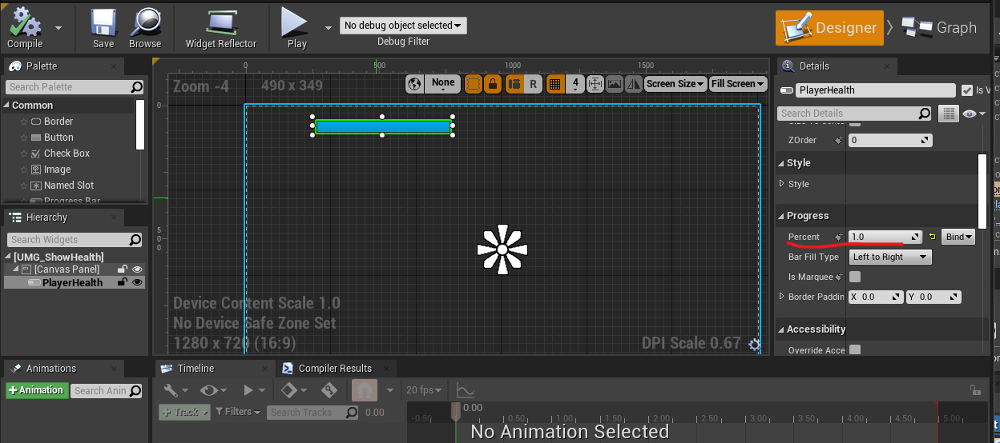

# UnrealEngineGAS系统
该章通过官方demo学习GAS系统，并自己复现一遍。
该章不会详细介绍官方demo，只会介绍自己另起工程复现的操作。可能会引用到demo的部分。
希望整个流程做完能够使读者对GAS各个组件间的关系能有较清晰的了解。

# 参考教程
[官方视频，demo工程在视频简介处](https://www.youtube.com/watch?v=YvXvWa6vbAA&ab_channel=UnrealEngine)
[这里也有demo工程](https://forums.unrealengine.com/t/inside-unreal-a-guided-tour-of-gameplay-abilities/156078)
如果工程页面打开有问题，翻看最新评论可看到是账号的级别不够，应该点击至少5个其他帖子来解锁 “信任级别1”
[GAS文档](https://docs.unrealengine.com/4.27/zh-CN/InteractiveExperiences/GameplayAbilitySystem/)
[其他demo，这里的文档有GAS的详细介绍](https://github.com/tranek/GASDocumentation)

# 素材
在商城下载虚幻争霸的Greystone角色。使用第三人称模板工程

# 制作思路
看完官方文档后，可知Gameplay Ability System是一个框架。首先人物要有属性，然后是释放技能的效果，需要的话还要添加技能的释放动画，一般技能的视觉效果是通过cues来添加。将和技能有关的东西整理到技能任务里面去，就形成一个完成的技能了。
Tag的使用比较万能，可以给Ability添加用来给技能分类并控制，也可以关联cue和effect等等

先启动模板工程，将操作人物设置为素材的Gerystone（不设置也行，因为它提供了动画和普攻甚至三连击的combo，后续方便补充功能）

# 配置属性
新建c++文件，继承自AttributeSet，用于编写属性集。这里赋予了生命值和最大生命值两个属性，并使用宏简略一些通用函数的编写。
.h文件如下
```cpp
// Fill out your copyright notice in the Description page of Project Settings.

#pragma once

#include "CoreMinimal.h"
#include "AbilitySystemComponent.h"
#include "AttributeSet.h"
#include "GameAbilityTestAttributeSet.generated.h"

/**
 * 
 */
UCLASS()
class UGameAbilityTestAttributeSet : public UAttributeSet
{
	GENERATED_BODY()
public:
	// 限制属性的修改
	void PostGameplayEffectExecute(const FGameplayEffectModCallbackData& Data) override;

	// 最大生命值
	UPROPERTY(EditAnywhere, BlueprintReadOnly, Category = "Charater")
	FGameplayAttributeData MaxHealth;
	GAMEPLAYATTRIBUTE_PROPERTY_GETTER(UGameAbilityTestAttributeSet, MaxHealth);
	GAMEPLAYATTRIBUTE_VALUE_GETTER(MaxHealth);
	GAMEPLAYATTRIBUTE_VALUE_SETTER(MaxHealth);
	GAMEPLAYATTRIBUTE_VALUE_INITTER(MaxHealth);

	UPROPERTY(EditAnywhere, BlueprintReadOnly, Category = "Charater")
	FGameplayAttributeData Health;
	GAMEPLAYATTRIBUTE_PROPERTY_GETTER(UGameAbilityTestAttributeSet, Health);
	GAMEPLAYATTRIBUTE_VALUE_GETTER(Health);
	GAMEPLAYATTRIBUTE_VALUE_SETTER(Health);
	GAMEPLAYATTRIBUTE_VALUE_INITTER(Health);
};
```
.cpp文件如下
```cpp
// Fill out your copyright notice in the Description page of Project Settings.


#include "GameAbilityTestAttributeSet.h"

#include "GameplayEffectExtension.h"

void UGameAbilityTestAttributeSet::PostGameplayEffectExecute(const FGameplayEffectModCallbackData& Data)
{
	Super::PostGameplayEffectExecute(Data);

	if(Data.EvaluatedData.Attribute == GetHealthAttribute())
	{
		SetHealth(FMath::Clamp(GetHealth(), 0.f, GetMaxHealth()));
	}
}
```

# 给人物添加属性和技能系统组件
给人物添加属性：这里是给人物添加指向属性的指针，具体的属性设置是在蓝图中通过 Attributemetatable 设置的，表格的设置能让属性的配置更为简洁，当然可以在构造函数里面进行属性的初始化，但是当属性一多，代码便变得复杂且不易于维护与更新。

添加技能系统：添加父类 IAbilitySystemInterface，然后在类中添加技能组件并实现父类的虚函数

打开Character.h，先继承AbilitySystem接口`public IAbilitySystemInterface`，然后添加以下代码。除了常规的获取属性的函数外，在BeginPlay函数里 `绑定了生命值改变时调用的委托函数，使用Gameplay Ability框架实现监视属性值的变化`。在GrantAbility函数里面实现技能的添加
```cpp
public:
	virtual void BeginPlay() override;
	
	UPROPERTY(VisibleDefaultsOnly, BlueprintReadOnly, Category = "Abilities")
	class UAbilitySystemComponent* AbilitySystemComponent;

    virtual UAbilitySystemComponent* GetAbilitySystemComponent() const override
    {
	    return AbilitySystemComponent;
    };

	UFUNCTION(BlueprintPure, Category = "Abilities | Attributes")
	float GetMaxHealth() const;

	UFUNCTION(BlueprintPure, Category = "Abilities | Attributes")
    float GetHealth() const;

	UFUNCTION(BlueprintCallable, Category = "Abilities | Attributes")
	void GrantAbility(TSubclassOf<UGameplayAbility> AbilityClass);
	
	// 绑定到 Attribute Changed delegate，Health 改变时回调
    void OnHealthChangedInternal(const FOnAttributeChangeData& Data);
	
	// 蓝图中实现。Health 改变时调用的蓝图事件，用作 UI实时显示
	UFUNCTION(BlueprintImplementableEvent, Category = "Abilities | Attributes")
	void OnHealthChanged(float oldValue, float newValue);

protected:
	UPROPERTY()
	const class UGameAbilityTestAttributeSet* AttributeSet;
```
Character.cpp
```cpp
void AGameAbilityTestCharacter::BeginPlay()
{
	Super::BeginPlay();

	// 初始化 attribute set 数据
	if(IsValid(AbilitySystemComponent))
	{
		// 属性数据在蓝图中绑定
		AttributeSet = AbilitySystemComponent->GetSet<UGameAbilityTestAttributeSet>();

		// 绑定委托
		AbilitySystemComponent->GetGameplayAttributeValueChangeDelegate(AttributeSet->GetHealthAttribute()).AddUObject(this, &AGameAbilityTestCharacter::OnHealthChangedInternal);
	}
}


float AGameAbilityTestCharacter::GetHealth() const
{
	if(IsValid(AttributeSet))
	{
		return AttributeSet->GetHealth();
	}
	return -1.0f;
}

void AGameAbilityTestCharacter::GrantAbility(TSubclassOf<UGameplayAbility> AbilityClass)
{
	if(GetLocalRole() == ROLE_Authority && IsValid(AbilitySystemComponent) && IsValid(AbilityClass))
	{
		UGameplayAbility* Ability = AbilityClass->GetDefaultObject<UGameplayAbility>();

		if(IsValid(Ability))
		{
			FGameplayAbilitySpec AbilitySpec(
    			Ability,
    			1
    		);

			AbilitySystemComponent->GiveAbility(AbilitySpec);
		}
	}
}

float AGameAbilityTestCharacter::GetMaxHealth() const
{
	if(IsValid(AttributeSet))
	{
		return AttributeSet->GetMaxHealth();
	}
	return 0.0f;
}

void AGameAbilityTestCharacter::OnHealthChangedInternal(const FOnAttributeChangeData& Data)
{
	OnHealthChanged(Data.OldValue, Data.NewValue);
}
```
在构造函数里面创建技能组件实例
```cpp
	AbilitySystemComponent = CreateDefaultSubobject<UAbilitySystemComponent>(TEXT("Ability System Component"));
```

# 关联属性表
启动游戏，在文件管理框里右键选择 Miscellaneous -> DataTable -> AttributeMetaData，创建属性表。
RowName的规则为ClassName.AttributeName，这里的ClassName忽略前缀，如图例子的ClassName为UGameAbilityTestAttributeSet。该表好像只有 BaseValue 有用？

打开人物蓝图，先查看蓝图的父类是否为自己编写的类，点击ClassSettings，检查ParentClass。父类正确后如图单击Ability System Component的details中关联属性表

此时编写蓝图，可以在 tick 中 GetHealth 查看属性配置是否正确

# 设置UI
设置UI是为了更好地观察生命值的变化。在代码中已经将生命值属性的变化绑定到 OnHealthChangedInternal 函数上，OnHealthChangedInternal 函数调用了OnHealthChanged，所以只要在蓝图中将 OnHealthChanged 函数调用与UI更新绑定即可实时更新生命值栏
下图为 Character 蓝图的编写

如下图，绘制UI并编写蓝图将生命值变化与UI更新绑定，实现生命值一变化就改变UI。需要注意的是进度条应该初始化为 100%


最后将UI显示在界面上即可，具体查看[UMG教程](https://docs.unrealengine.com/4.27/zh-CN/InteractiveExperiences/UMG/QuickStart/)
此时启动游戏就能看到表示生命值的条了

# 创建技能任务
这里使用蓝图创建技能，在文件管理框里面右键 -> Gameplay -> Gameplay Ability Blueprint创建技能蓝图，编写简单技能蓝图，如输出字符串，`确保技能结束时调用 EndAbility`，下图为添加技能效果后的，可忽略部分

接下来回到Character的蓝图，规定按下P键释放技能。先在游戏开始时添加技能，然后在按下P键时使用 `Try Activate Ability by Class` ，设置技能蓝图指定激活的技能，如下图。若成功，此时屏幕出现Hello，失败请检查是否enable input


# 添加技能效果
Ability Effect 使用纯数据类型即可满足大部分的效果需求。新建蓝图类，继承于GameplayEffect，具体设置看蓝图，例子中实现的效果是，瞬发扣自身 5 点生命值

参照创建技能任务那一节的图，添加effect。完成后运行游戏测试一下，按P键

血量在减少的时候会发现血量的变化函数被调用了两次，到血槽为空时这个答案就显现了，原因在于属性的cpp文件中，PostGameplayEffectExecute函数规定了修正的血量的范围，到血槽为空时血量小于0，之后被修正为0。

# 添加技能效果
关于Cue的具体介绍看参考教程，这里只是拿个举例熟悉一下简单流程。
新建GameplayCueNotify_Actor蓝图类，Actor类可以创建实例。如图添加一个粒子特效

然后打开类默认值，设置cue的标签，并设定为移除后自动销毁和自动跟随目标，这样技能结束时就会销毁cue，在技能持续期间会跟随释放者移动。

打开effect文件，如图修改技能效果为持续并绑定cue tag


测试效果


# 小结
AttributeSet 给人物设置属性，GameplayEffect实现技能效果，Cues和Tag用来提供技能的视觉反馈。GASComponent负责控制Ability，Character内置AttributeSet，从游戏的开始就向GASComponent添加Ability，自定义触发键后，通过GASComponent触发技能，运行GameplayAbility，在Ability里面添加Effect和Cues，完成技能的实现。
通过Tag可以实现GAS各功能之间的交互，比如应用cue。实质上Tag就只是标签，通过标签可以进行技能的便捷管理