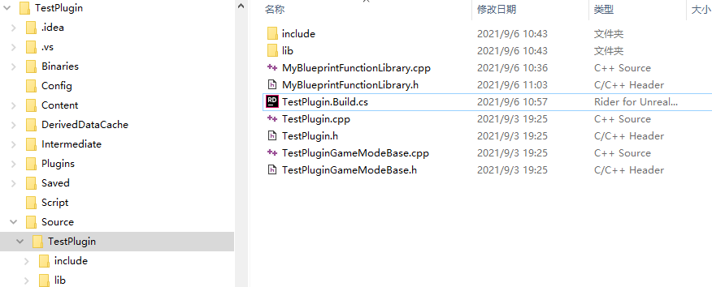
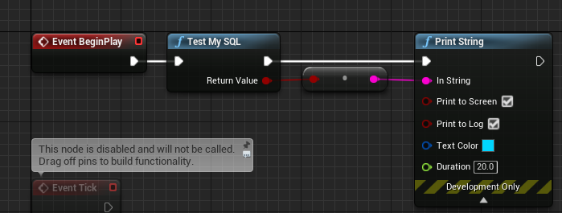

采用unreal链接第三方库的方式，以连接 mysql 为例子，学习 unreal 链接第三方静态库。
主要参考 unreal 的第三方库插件的写法，在新建的 unreal 项目中，新建插件，选第三方库即可得到模板

### 环境
windows10
UE4 源码编译
mysql 源码编译

### 测试准备，适用lib，dll链接的测试
新建TestPlugin的C++空项目，连接的模块为TestPlugin项目工程。运行工程并且新建C++蓝图函数库文件，命名`MyBlueprintFunctionLibrary`


## 一、静态库链接
复制mysql源码里的lib文件夹，include文件夹到Source/TestPlugin文件夹下(图路径查找的方便，就放在Build.cs文件同目录下)，文件目录如图

打开TestPlugin.Build.cs文件，添加如下
```cs
// Copyright Epic Games, Inc. All Rights Reserved.

using System.IO;
using UnrealBuildTool;

public class TestPlugin : ModuleRules
{
	public TestPlugin(ReadOnlyTargetRules Target) : base(Target)
	{
		PCHUsage = PCHUsageMode.UseExplicitOrSharedPCHs;
	
		PublicDependencyModuleNames.AddRange(new string[] { "Core", "CoreUObject", "Engine", "InputCore" });

		PrivateDependencyModuleNames.AddRange(new string[] {  });

		// 添加静态库文件
		PublicIncludePaths.Add(Path.Combine(ModuleDirectory, "include"));
		PublicAdditionalLibraries.Add(Path.Combine(ModuleDirectory, "lib", "libmysql.lib"));
		
		// Uncomment if you are using Slate UI
		// PrivateDependencyModuleNames.AddRange(new string[] { "Slate", "SlateCore" });
		
		// Uncomment if you are using online features
		// PrivateDependencyModuleNames.Add("OnlineSubsystem");

		// To include OnlineSubsystemSteam, add it to the plugins section in your uproject file with the Enabled attribute set to true
	}
}

```
### 测试
打开新建的蓝图函数库文件`MyBlueprintFunctionLibrary.h/cpp`，代码如下
```cpp
// Fill out your copyright notice in the Description page of Project Settings.

#pragma once


#include "Windows/AllowWindowsPlatformTypes.h"
#include "include/mysql.h"
#include "Windows/HideWindowsPlatformTypes.h"

#include "CoreMinimal.h"
#include "Kismet/BlueprintFunctionLibrary.h"
#include "MyBlueprintFunctionLibrary.generated.h"

/**
 * 
 */
UCLASS()
class TESTPLUGIN_API UMyBlueprintFunctionLibrary : public UBlueprintFunctionLibrary
{
	GENERATED_BODY()
public:
	UFUNCTION(BlueprintCallable, Category="MySQL")
	static bool TestMySQL();
};

```
```cpp
// Fill out your copyright notice in the Description page of Project Settings.


#include "MyBlueprintFunctionLibrary.h"

bool UMyBlueprintFunctionLibrary::TestMySQL()
{
	MYSQL sqlStruct;
	mysql_init(&sqlStruct);
	auto f = mysql_real_connect(&sqlStruct, /*这部分自己填*/);
	if(f)
	{
		mysql_query(&sqlStruct, "select * from user;");
		auto res = mysql_store_result(&sqlStruct);

		auto row = mysql_fetch_row(res);
		while(row)
		{
			GEngine->AddOnScreenDebugMessage(0, 20.0f, FColor::Red, row[0]);
			row = mysql_fetch_row(res);
		}
		mysql_close(&sqlStruct);
	}
	return bool(f);
}

```

最后编译，打开关卡蓝图进行编写测试



### 关于UE4与windows系统的冲突
[UE4之windows.h冲突](https://blog.51cto.com/u_12701820/3032456)
Build之后会出现TEXT重定义的警告，发现是在引用mysql.h文件的时候，TEXT宏定义在unreal和windows库文件都出现了
解决方式如下
```cpp
#include "Windows/AllowWindowsPlatformTypes.h"
#include "include/mysql.h"
#include "Windows/HideWindowsPlatformTypes.h"
```


## 参考
[github上别人的mysql插件](https://github.com/Back2RL/MySQLConnectorUE4Plugin)
[C++程序调用mysql数据库
](https://blog.csdn.net/Leo_csdn_/article/details/82682839)

[UE4学习笔记--连接MySQL数据库（C++）
](https://blog.csdn.net/qq_40725856/article/details/97544992)
> 这个学习笔记教程的应用好像是mysql安装版的。搜索MySQL Connector的作用，会发现里面的API跟用mysql源码配置的C++工程一样

[详解UE4静态库与动态库的导入与使用](https://blog.csdn.net/u012999985/article/details/71554628)

[UE4链接第三方库（lib和dll）](https://segmentfault.com/a/1190000008210614)

unreal自建的第三方库插件